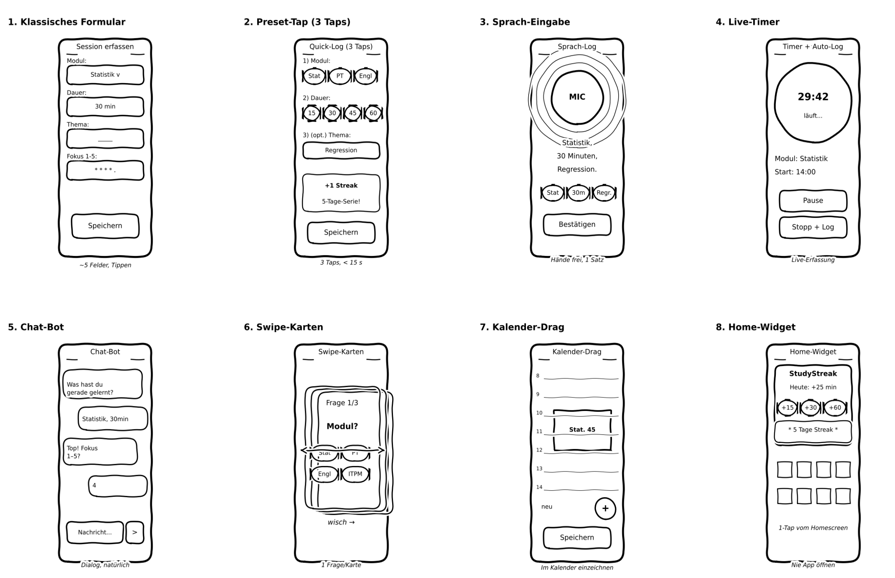
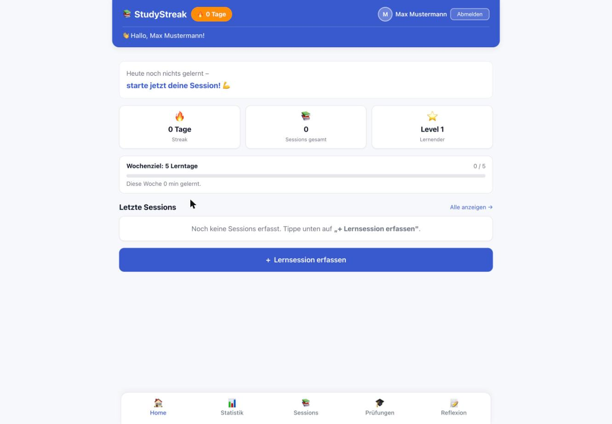
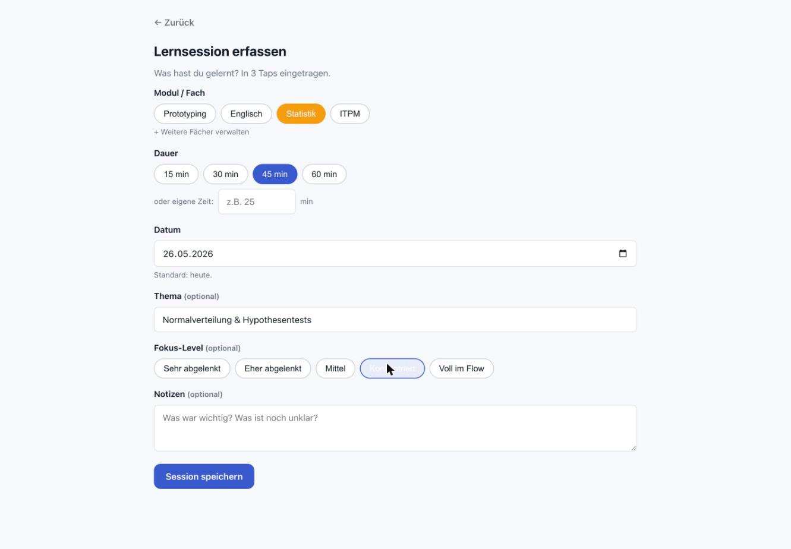
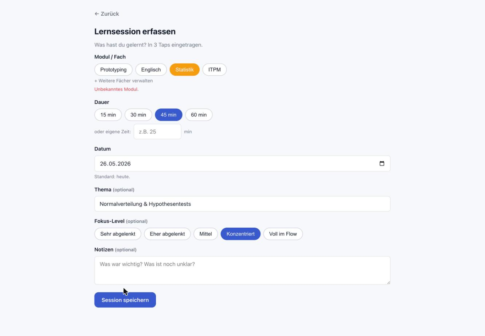
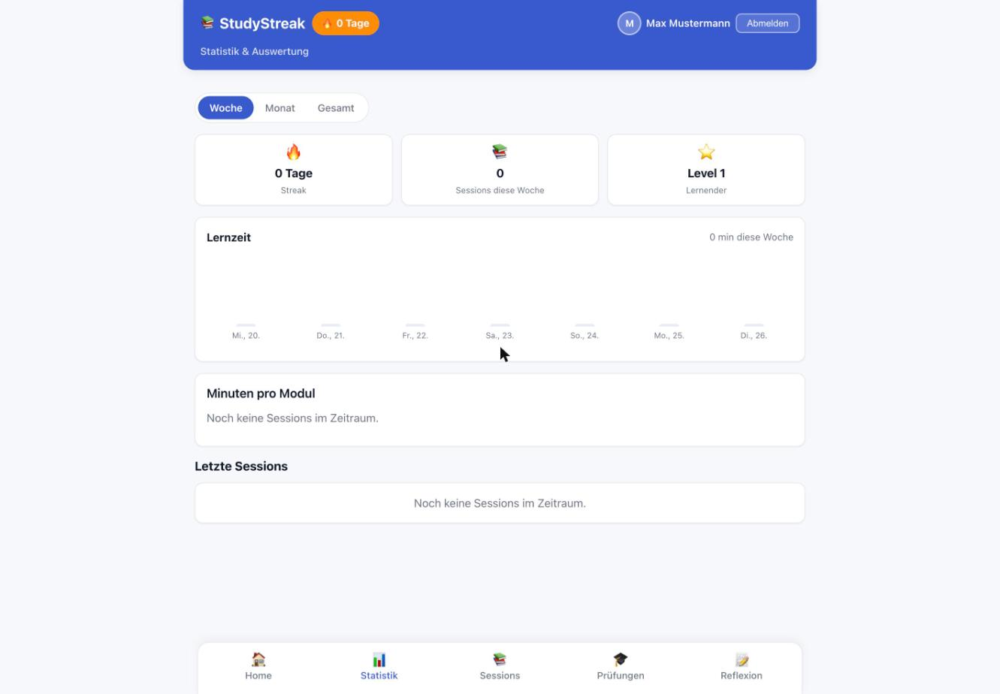
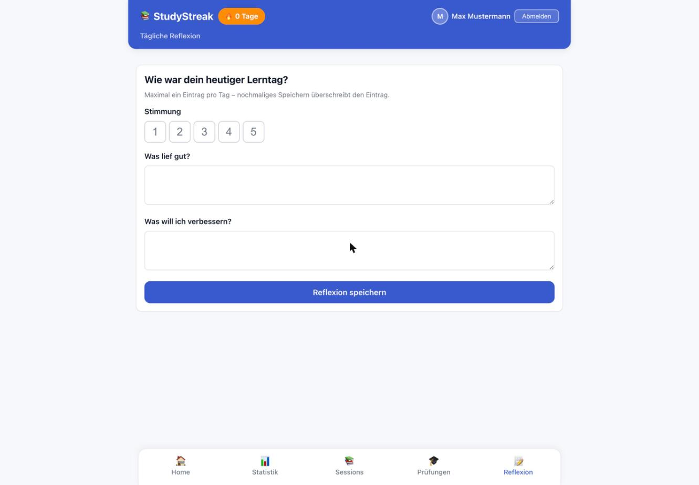

# Projektdokumentation - StudyStreak

> **Live-Demo:** https://study-streak.netlify.app  
> **Repository:** https://github.com/dalipivaldrin/studystreak  
> **Login für Dozierende:** Konto selbst registrieren unter https://study-streak.netlify.app/login (kostenlos, kein E-Mail-Bestätigung nötig)

## Inhaltsverzeichnis

1. [Ausgangslage](#1-ausgangslage)
2. [Lösungsidee](#2-lösungsidee)
3. [Vorgehen & Artefakte](#3-vorgehen--artefakte)
   1. [Understand & Define](#31-understand--define)
   2. [Sketch](#32-sketch)
   3. [Decide](#33-decide)
   4. [Prototype](#34-prototype)
   5. [Validate](#35-validate)
4. [Erweiterungen [Optional]](#4-erweiterungen-optional)
5. [Projektorganisation [Optional]](#5-projektorganisation-optional)
6. [KI-Deklaration](#6-ki-deklaration)
7. [Anhang [Optional]](#7-anhang-optional)

> **Hinweis:** Massgeblich sind die im **Unterricht** und auf **Moodle** kommunizierten Anforderungen.

<!-- WICHTIG: DIE KAPITELSTRUKTUR DARF NICHT VERÄNDERT WERDEN! -->

<!-- Diese Vorlage ist für eine README.md im Repository gedacht. Abschnitte mit [Optional] können weggelassen werden, wenn in den Übungen nichts anderes verlangt wird. -->

## 1. Ausgangslage

- **Problem:** Studierende im ersten Studienjahr an der ZHAW müssen parallel mehrere Module (Prototyping, ITPM, Statistik, Englisch u. a.) bearbeiten. Ein häufig beobachtetes Muster: In den ersten Wochen des Semesters wird wenig konsistent gelernt, kurz vor den Prüfungen entsteht eine chaotische, stressige Last-Minute-Phase. Die Lernpsychologie (Spacing Effect nach Ebbinghaus) zeigt, dass verteiltes Lernen signifikant bessere Langzeitergebnisse liefert als Cramming – dieses Wissen wird jedoch selten umgesetzt, weil ein einfaches, niedrigschwelliges Werkzeug fehlt, um Lerngewohnheiten zu etablieren und kleine tägliche Erfolge sichtbar zu machen.
- **Ziele:**
  - Regelmässiges, verteiltes Lernen durch Gamification-Elemente fördern (Streaks, Level, XP)  - Lernsessions in unter 30 Sekunden erfassen können
  - Lernverhalten über Zeit sichtbar machen (Statistiken, Wochenziele pro Modul)
  - Intrinsische Motivation durch sichtbaren Fortschritt und Sofortbelohnung stärken
- **Primäre Zielgruppe:** ZHAW-Studierende im 1.–3. Semester Informatik und Wirtschaftsinformatik, die mehrere Module parallel betreuen und ihren Lernfortschritt strukturieren möchten.
- **Weitere Stakeholder:** Selbstlernende ausserhalb der Hochschule (Sprachkurse, Weiterbildung), die von Habit-Tracking profitieren.

## 2. Lösungsidee

- **Kernfunktionalität:**
  - **Session-Logging:** Formular mit Modul, Datum, Dauer (Minuten), Thema, Fokus-Rating (1–5) und optionalen Notizen. Vollständige CRUD-Operationen (Anlegen, Bearbeiten, Löschen).
  - **Modul-Verwaltung:** Vordefinierte Module mit Farbcodes (Prototyping, ITPM, Statistik, Englisch), später erweiterbar durch eigene Module.
  - **Wöchentliche Ziele pro Modul:** z. B. „mindestens 180 Minuten Statistik pro Woche", inklusive Status (aktiv / erledigt).
  - **Tägliche Reflexion:** Stimmung (1–5), „Was lief gut?" und „Was will ich verbessern?". Genau ein Eintrag pro Tag (Upsert).
  - **Dashboard:** KPI-Kacheln mit aktuellem Streak, Wochenminuten, Level mit Fortschrittsbalken, Anzahl Sessions und zuletzt erfassten Sessions.
  - **Gamification:** Streak-Logik (Tage in Folge), Level-System (alle 300 Minuten Lernzeit ein neues Level)- **Annahmen:** Wenn das Dokumentieren fast nichts kostet (< 30 Sekunden) und der Fortschritt sofort sichtbar wird, entsteht eine stabile Lerngewohnheit.
- **Abgrenzung:**
  - Kein Live-Pomodoro-Timer (andere Apps lösen das besser)
  - Kein soziales Netzwerk (keine Freundeslisten, keine öffentlichen Rankings)
  - Keine Task-Management-App (StudyStreak denkt in Sessions, nicht in einzelnen Tasks)

| Tool | Fokus | Schwäche für unsere Zielgruppe |
|---|---|---|
| Notion | Sehr flexibler Workspace | Keine Lern-Spezialisierung, hohe Einstiegshürde |
| Habitica | Allgemeines Habit-Tracking mit Gamification | Kein Fach- oder Modulbezug |
| Forest / Flora | Live-Timer während des Lernens | Löst nicht das Reflektieren & Dokumentieren nach der Session |
| **StudyStreak** | **Retrospektives Logging mit Modulbezug** | – |

## 3. Vorgehen & Artefakte

Die Durchführung erfolgt phasenbasiert nach der im Modul behandelten Methodik (Design Sprint kombiniert mit Human-Centered Design, ISO 9241-210).

### 3.1 Understand & Define

- **Zielgruppenverständnis:**
  - *Proto-Persona:* Valdrin, 22 Jahre, Informatik-Student im 1. Semester, muss parallel mehrere Module betreuen. Lernt unregelmässig, vergisst oft was er wann gelernt hat. Nutzt bereits Apps wie Duolingo und schätzt den Streak-Mechanismus. Wünscht sich eine schnelle, nicht ablenkende Lösung.
  - *Recherche:* Kurz-Interviews und Analyse existierender Tools (Notion, Habitica, Forest/Flora). Habit-Tracking-Apps sind besonders erfolgreich, wenn sie kurzfristige Belohnungen mit langfristigen Zielen kombinieren (Gamification-Literatur).
- **Wesentliche Erkenntnisse:**
  - Studierende wollen eine möglichst schnelle Erfassung (< 30 Sekunden) – die App soll nicht während des Lernens stören
  - Sichtbarer Fortschritt (Streak, XP) erhöht die Motivation nachweislich
  - Modulbezogene Auswertungen sind relevanter als generelle Zeitstatistiken
  - Retrospektives Logging (nach der Session) ist für den Alltag geeigneter als ein Live-Timer

### 3.2 Sketch

- **Variantenüberblick (Crazy 8s):** Im Rahmen der Design-Sprint-Methodik (Day 2) wurden acht möglichst unterschiedliche Varianten des Kernfeatures „Lernsession in < 30 Sekunden erfassen" skizziert (je 1 Minute pro Variante):

| # | Variante | Kurzbeschreibung |
|---|---|---|
| 1 | **Klassisches Formular** | Modul-Dropdown, Zahlen-Input für Dauer, Fokus-Slider, Speichern-Button. Vertraut, aber viele Taps. |
| 2 | **Preset-Tap (3 Taps)** | Modul-Chips (Favoriten zuerst), Dauer-Chips (15/30/45/60), Thema/Fokus optional, Speichern. ≤ 3 Taps für den Happy Path. |
| 3 | **Sprach-Eingabe** | Mikrofon-Screen: Spracheingabe wird per Speech-to-Text geparst und bestätigt. |
| 4 | **Live-Timer mit Auto-Log** | Pomodoro-artiger Timer, der nach Stop automatisch eine Session anlegt. |
| 5 | **Chat-Bot** | Konversations-UI: Bot fragt nacheinander nach Modul, Dauer und Fokus. |
| 6 | **Swipe-Karten** | Pro Attribut eine Kartenspalte, die durchgewischt wird (Tinder-Style). |
| 7 | **Kalender-Drag** | Nutzer zieht einen Block im Tageskalender auf – Start/Ende = Dauer. |
| 8 | **Home-Widget** | iOS-Widget mit Quick-Log-Tasten, kein App-Öffnen nötig. |

- **Skizzen:** Crazy 8s auf Papier (Abb. 1) sowie ausgearbeitete Happy-Path-Skizze der gewählten Variante 2 (Abb. 2) – drei aufeinanderfolgende Mobile-Screens, jeder Pfeil entspricht einem Tap.

- 

### 3.3 Decide

**Gewählte Variante & Begründung:** Variante 2 – Preset-Tap (3 Taps)

Die Preset-Tap-Variante erfüllt das Kernversprechen am kompromisslosesten:

- **Geschwindigkeit:** Modul-Chip + Dauer-Chip + Speichern = 3 Taps, klar unter 30 Sekunden
- **Retrospektiv:** Kein Timer, keine Push-Notifikation während des Lernens – passt zur bewussten Entscheidung, dass die App nicht stören soll
- **Gamification-Anschluss:** Nach dem Speichern wird sofort Streak-/Badge-Rückmeldung auf einem eigenen Screen angezeigt – das ist der motivationale Kern
- **Mobile-first:** Keine Eingabefelder, die die Tastatur aufziehen – alles läuft über Chips und Sterne, auch einhändig bedienbar

**Abgelehnte Varianten:** V3 (Sprache) – in Bibliotheken unrealistisch; V4 (Live-Timer) – widerspricht dem retrospektiven Konzept; V6/V7 (Swipe, Kalender) – zu viele Interaktionen für < 30 s; V8 (Widget) – für MVP-Phase zu früh

**End-to-End-Ablauf:**

1. Nutzer öffnet App → sieht Dashboard (Streak, letzte Sessions, Wochenziel)
2. Tippt auf „+ Lernsession erfassen"
3. Wählt Modul-Chip (Favoriten zuerst, sortiert nach Häufigkeit)
4. Wählt Dauer-Chip (15 / 30 / 45 / 60 min oder eigene Zeit)
5. Gibt optional Thema (Freitext) und Fokus-Level (Sternebewertung 1–5) an
6. Tippt „Session speichern" → Bestätigungsscreen mit Streak +1, Badge und XP-Anzeige
7. Alternativ: Nutzer wechselt über Bottom Nav zum Stats-Tab → Lernzeit-Auswertung nach Woche/Monat/Gesamt

**Mockup:**

🔗 [Figma Prototyp](https://www.figma.com/proto/studystreak)  
Der Prototyp umfasst sechs verlinkte Screens: Home, Modul wählen, Dauer & Details, Gespeichert, Statistik und Reflexion.

### 3.4 Prototype

#### 3.4.1. Entwurf (Design)

**Wichtigste Screens der fertigen App:**

| Screen | Beschreibung |
|--------|-------------|
|  | **Dashboard:** Streak-Pill im Header (1 Tag), KPI-Kacheln (Sessions gesamt, Level, Wochenminuten), Fortschrittsbalken zum nächsten Level, Liste der letzten 5 Sessions. |
|  | **Session erfassen:** Modul-Chips (farblich), Dauer-Presets (15/30/45/60 min), optionaler Freitext für Thema und Fokus-Rating (1–5). |
|  | **Session gespeichert:** Erfolgsmeldung mit Session-Detailkarte inkl. Modul-Farbe, Dauer, Fokus-Notizen. Streak-Anzeige, Buttons für Löschen und neue Session. |
|  | **Statistik-Seite:** Balkendiagramm (Lernzeit/Tag, Woche/Monat/Gesamt), Modul-Aufschlüsselung (farbig), Tab-Auswahl für Zeiträume. |
|  | **Tägliche Reflexion:** Stimmungs-Rating (1–5), zwei Freitextfelder (Upsert pro Tag). Erfolgs-Bestätigung nach Speichern. |

> Hinweis: Hier wird der Prototyp beschrieben, nicht das Mockup.

- **Informationsarchitektur:**

- **Designentscheidungen:**
  - **Mobile-First:** Die App ist auf Smartphone-Layouts (max-width 480 px) optimiert und nutzt Bottom Navigation, da Lernen mobil und spontan stattfindet
  - **Bottom Navigation:** Etabliertes Muster für mobile Apps; alle Hauptbereiche mit dem Daumen erreichbar (Thumb-Zone-freundlich)
  - **Farbkonzept:** Blau (#3A5ACC) für primäre Aktionen und App-Header, Orange (#FF8C00) für Streak-Badge, Grün (#28A745) für Erfolg/Speichern. Pro Modul eine eigene Akzentfarbe (Prototyping = violett, ITPM = grün, Statistik = gelb, Englisch = rot).
  - **Pill-/Chip-Buttons für Modulwahl:** schnelles Antippen ohne Tastatur, auch einhändig bedienbar
  - **Gamification prominent:** Streak immer im Header sichtbar; Erfolgsmeldung nach dem Speichern als Banner auf der Detailseite
  - **Statistik-Tab:** Balkendiagramm (handgezeichnetes SVG, keine externe Lib) mit Woche/Monat/Gesamt-Filter gibt schnelle Übersicht ohne tiefe Navigation
  - **Progressive Enhancement:** Alle CRUD-Aktionen funktionieren über SvelteKit Form Actions – auch ohne JavaScript bedienbar
  - **Offene Punkte für weiteres Prototyping:** Verhalten bei fehlendem Internet (Optimistic UI), eigener Erfolgs-Screen mit Badge-Animation, Wochenziel-Konfiguration pro Modul, eigene Module anlegen können

#### 3.4.2. Umsetzung (Technik)

- **Technologie-Stack:** SvelteKit 2 (Svelte 4) für Frontend & Backend; SvelteKit Form Actions mit Progressive Enhancement (`use:enhance`) für robuste CRUD-Abläufe; handgeschriebenes CSS mit CSS-Variablen für volle Designkontrolle.
- **Tooling:** Figma (Mockup & Prototyping), VS Code mit GitHub Copilot, Vite als Build-Tool, ESM-Modules.
- **Struktur & Komponenten:**

```
studystreak/
├─ src/
│  ├─ app.css                    ← Globales Stylesheet (Design-Tokens als CSS-Variablen)
│  ├─ app.html                   ← HTML-Shell
│  ├─ hooks.server.js            ← Server-Hook: Request-Logging
│  ├─ lib/
│  │  ├─ constants.js            ← Module, Dauer-Presets, Badge-Definitionen
│  │  ├─ server/db.js            ← MongoDB-Client (gepoolt, Singleton)
│  │  ├─ utils/
│  │  │  ├─ gamification.js      ← Streak-, Level-, Stats-Berechnung
│  │  │  └─ validation.js        ← Server-Validierung für Form-Inputs
│  │  └─ components/
│  │     ├─ BottomNav.svelte
│  │     ├─ StreakDisplay.svelte
│  │     ├─ StatBadge.svelte
│  │     ├─ SessionCard.svelte
│  │     ├─ LevelProgress.svelte
│  │     ├─ BadgeCard.svelte
│  │     └─ BarChart.svelte
│  └─ routes/
│     ├─ +layout.svelte          ← App-Header, Bottom-Nav, Slot
│     ├─ +layout.server.js       ← Globale Stats-Daten für Header
│     ├─ +page.svelte            ← Dashboard
│     ├─ +page.server.js
│     ├─ +error.svelte
│     ├─ sessions/
│     │  ├─ new/                 ← Session erfassen (POST → DB → Redirect)
│     │  └─ [id]/                ← Detail + Edit + Delete
│     ├─ stats/                  ← Auswertung (Woche/Monat/Gesamt)
│     ├─ badges/                 ← Badge-Galerie
│     └─ reflection/             ← Tägliche Reflexion (Upsert)
└─ static/
   ├─ favicon.svg
   └─ robots.txt
```

- **Daten & Schnittstellen:** MongoDB Atlas (Free-Tier M0). Zwei Collections:

| Collection | Felder |
|---|---|
| `sessions` | `_id`, `module` (id), `duration` (min), `date`, `topic?`, `focus?` (1–5), `notes?`, `createdAt`, `updatedAt` |
| `reflections` | `_id`, `dateKey` (YYYY-MM-DD, unique), `mood` (1–5), `wentWell?`, `improve?`, `date`, `createdAt`, `updatedAt` |

  Reflexionen werden über einen Upsert mit `dateKey` als natürlichem Schlüssel gespeichert – damit gibt es pro Tag genau einen Eintrag. Alle Datenbankzugriffe laufen ausschliesslich serverseitig (`+page.server.js` / Form Actions). Der MongoDB-Client wird als Singleton-Promise gehalten und in Netlify-Functions zwischen Aufrufen wiederverwendet (Cold-Start-Optimierung).

  **Validierung:** Jede Form Action validiert die Eingaben über `validateSession` / `validateReflection` (Pflichtfelder, Längenlimits, Wertebereiche, Datumsplausibilität). Fehler werden über `fail(400, { errors, values })` an die Seite zurückgegeben und dort feldweise angezeigt; die eingegebenen Werte bleiben im Formular erhalten.384


  Screenshots:

  

  

- **Deployment:** Netlify mit `@sveltejs/adapter-netlify`. Konfiguration in `netlify.toml`; Build-Command `npm run build`, Publish-Verzeichnis `build`. Umgebungsvariablen werden im Netlify-Dashboard hinterlegt.  
  **URL:** https://study-streak.netlify.app
385
  
- **Lokale Entwicklung:**


### Systemanforderungen:
- Node.js 18+ (getestet mit 20.x)
- - npm 9+ (oder pnpm 8.x)
  - - SvelteKit 2.x
```bash
# 1. Repo klonen
git clone https://github.com/dalipivaldrin/studystreak
cd studystreak

# 2. Abhängigkeiten installieren
npm install

# 3. .env anlegen (Vorlage: .env.example)
cp .env.example .env
# MONGODB_URI eintragen

# 4. Dev-Server starten
npm run dev
# → http://localhost:5173
```

- **Besondere Entscheidungen:**
  - Handgeschriebenes CSS mit CSS-Variablen statt Framework → volle Kontrolle über Look-and-Feel, kein Build-Overhead
  - MongoDB statt SQLite aus Deployment-Gründen (Serverless-Kompatibilität, Netlify hat kein persistentes Filesystem)
  - Form Actions statt Client-side Fetch → funktioniert auch ohne JavaScript (Progressive Enhancement) und reduziert Komplexität
  - Streak/Level/Stats werden bei jedem Request neu berechnet, nicht in der DB persistiert → eine einzige Quelle der Wahrheit (die Sessions), keine Inkonsistenzen möglich

### 3.5 Validate

**URL der getesteten Version:** https://study-streak.netlify.app (getestet am 14. Mai 2026)

**Ziele der Prüfung:**
- Ist der Kernworkflow „Lernsession in unter 30 Sekunden erfassen" ohne Anleitung auffindbar und durchführbar?
- Funktioniert die Bearbeitung einer bereits gespeicherten Session?
- Ist die tägliche Reflexion intuitiv nutzbar?
- Findet die Testperson die Wochenstatistik ohne Hilfe?

**Vorgehen:** Moderierter Thinking-Aloud-Usability-Test, on-site. Testperson spielt Szenarien durch, Testleiter beobachtet ohne einzugreifen. Feedback-Grid zur Protokollierung. → [Vollständiges Testskript & Feedback-Grid](docs/usability-test-skript.md)

**Stichprobe:** 1 Testperson – Marko Vukcevic, ZHAW-Mitstudent (Informatik), kennt Habit-Tracking-Apps (Duolingo), hat StudyStreak vor dem Test nicht gesehen.

**Aufgaben/Szenarien:**

> *Ausgangslage:* Sie sind Informatik-Student im ersten Semester und möchten Ihre Lerngewohnheiten verbessern.

**Aufgabe 1:** Sie möchten festhalten, dass Sie heute 45 Minuten für das Modul Statistik gelernt haben. Erfassen Sie diese Session in der App.  
*Erfolgskriterium: Session erscheint auf dem Dashboard.*

**Aufgabe 2:** Sie möchten die eben erfasste Session nachträglich korrigieren – die Dauer war eigentlich 60 Minuten. Passen Sie die Session an.  
*Erfolgskriterium: Geänderte Dauer wird korrekt angezeigt.*

**Aufgabe 3:** Sie möchten eine kurze tägliche Reflexion eintragen. Ihre Stimmung ist heute eine 4.  
*Erfolgskriterium: Reflexion erscheint in der Reflexionsliste.*

**Aufgabe 4:** Sie möchten wissen, wie viele Minuten Sie diese Woche insgesamt gelernt haben.  
*Erfolgskriterium: Statistik-Seite wird gefunden und korrekt gelesen.*

**Kennzahlen & Beobachtungen:**

| Task | Ergebnis | Beobachtung |
|---|---|---|
| T1 – Session erfassen | ✅ Abgeschlossen (ca. 22 s) | Modul-Chips sofort verstanden. Dauer-Presets intuitiv. |
| T2 – Session bearbeiten | ⚠️ Abgeschlossen mit Umweg | Suchte zuerst auf dem Dashboard nach einem Bearbeitungs-Button direkt auf der Session-Karte, fand diesen nicht sofort. |
| T3 – Reflexion | ✅ Abgeschlossen | Bottom Nav Einstieg sofort klar. Stimmungs-Rating intuitiv. |
| T4 – Stats lesen | ✅ Abgeschlossen | Stats-Tab gefunden, Diagramm korrekt interpretiert. |

⚠️ = abgeschlossen, aber mit merklicher Verzögerung oder Umweg

**Feedback-Grid – Marko Vukcevic:**

| ✅ Was hat gut funktioniert / gefallen? | ❌ Was hat nicht funktioniert / gestört? |
|---|---|
| Chip-Auswahl für Modul und Dauer ist sehr schnell und intuitiv | Session-Karte auf dem Dashboard ist nicht klickbar – Bearbeitung erfordert Umweg |
| Streak-Counter auf dem Dashboard motivierend | Nach dem Speichern war der „Zurück zum Dashboard"-Link zu klein und kaum sichtbar |
| Farbliche Modul-Kennzeichnung hilft bei der Orientierung | Tab-Label „Stats" etwas generisch – nicht sofort klar, was sich dahinter verbirgt |
| App läuft auch auf dem Smartphone gut | – |

| 💡 Neue Ideen / Anforderungen | ❓ Was war unklar? |
|---|---|
| Session direkt per Klick auf Dashboard-Karte bearbeiten können | Wo findet man die Bearbeitungsfunktion für bestehende Sessions? |
| Wochenziel-Anzeige auch auf der Stats-Seite weiter oben platzieren | Unterschied zwischen „Stats"-Tab und der allgemeinen Übersicht |
| Optional: kurze Onboarding-Tour beim ersten App-Start | – |

**Zusammenfassung der Resultate:** Der Kernworkflow (T1 – Session erfassen) wurde in ~22 Sekunden und ohne Hilfe abgeschlossen – das Kernziel von unter 30 Sekunden ist erreicht. Die Reflexions- und Statistik-Workflows funktionieren ebenfalls problemlos. Die grösste Schwachstelle ist die fehlende Direktnavigation von der Session-Karte auf dem Dashboard zur Bearbeitungsansicht (T2). Zwei Verbesserungen wurden als GitHub-Issues angelegt und direkt umgesetzt (siehe Kap. 4 und 5).

**Abgeleitete Verbesserungen:**

| Priorität | Massnahme | Begründung |
|---|---|---|
| **Hoch** ✅ | Session-Karte auf dem Dashboard klickbar machen → direkt zur Detail-/Bearbeitungs-Ansicht ([Issue #2](https://github.com/dalipivaldrin/studystreak/issues/2), umgesetzt) | T2: Testperson erwartete Direktnavigation |
| **Hoch** ✅ | Auf dem „Session gespeichert"-Screen deutlicheren CTA-Button „→ Zum Dashboard" einfügen ([Issue #1](https://github.com/dalipivaldrin/studystreak/issues/1), umgesetzt) | Link „← Zurück" war zu wenig sichtbar |
| **Mittel** ✅ | Tab-Label von „Stats" zu „Statistik" ändern ([Issue #3](https://github.com/dalipivaldrin/studystreak/issues/3), umgesetzt) | Tab-Bezeichnung war zu generisch |
| **Gering** | Wochenziel-Widget auf der Stats-Seite weiter oben platzieren | Bessere Sichtbarkeit des Fortschritts |
| **Gering** | Kurzes Onboarding-Overlay beim ersten App-Start | Allgemeine Orientierung für neue Nutzer |

## 4. Erweiterungen [Optional]

Folgende Erweiterungen gehen über den geforderten Mindestumfang (1 Hauptworkflow + Übersicht + Erfassen) hinaus:

### 4.1 Statistik-Seite mit interaktiven Filtern und SVG-Diagramm

- **Beschreibung & Nutzen:** Die Statistik-Seite zeigt ein Balkendiagramm der Lernzeit pro Tag (filterbar nach Woche / Monat / Gesamt) und eine Modul-Aufschlüsselung mit Farbcode. Ermöglicht Studierenden, Lernmuster zu erkennen und schwächere Module gezielt zu fördern.
- **Wo umgesetzt:**
  - Frontend: `src/routes/stats/+page.svelte` (Tabs, Diagramm-Rendering), `src/lib/components/BarChart.svelte` (SVG-Balkendiagramm)
  - Backend: `src/routes/stats/+page.server.js` (Aggregation der Sessions nach Zeitraum und Modul)
- **Referenz:** Screenshot in Kap. 3.4.1 (Statistik-Screen)
- **Aus Evaluation abgeleitet?** Nein – war von Anfang an Teil des Konzepts (User Journey Schritt 7)

### 4.2 Gamification-Pipeline (Streak, Level, Badges)

- **Beschreibung & Nutzen:** Eine eigene Logik-Bibliothek berechnet den aktuellen und längsten Streak (Tage in Folge), das Level (1 Level = 300 Minuten) und prüft 7 regelbasierte Badges. Sichtbarer Fortschritt erhöht die Motivation und fördert das tägliche Zurückkehren zur App.
- **Wo umgesetzt:**
  - Backend/Logik: `src/lib/utils/gamification.js` (Streak-Algorithmus, Level-Berechnung, Badge-Auswertung)
  - Frontend: `src/lib/components/StreakDisplay.svelte`, `src/lib/components/LevelProgress.svelte`, `src/lib/components/BadgeCard.svelte`, Route `src/routes/badges/+page.svelte`
- **Referenz:** Screenshot in Kap. 3.4.1 (Home-Screen zeigt Streak-Pill und Level-Balken; Badges-Screen)
- **Aus Evaluation abgeleitet?** Nein – war von Anfang an geplant. Marko kommentierte spontan positiv über den Streak-Counter.

### 4.3 Zweiter Workflow „Tägliche Reflexion"

- **Beschreibung & Nutzen:** Eigener Workflow zur täglichen Selbstreflexion mit Stimmungs-Rating (1–5) und zwei Freitextfeldern. Pro Tag genau ein Eintrag (Upsert-Logik). Ergänzt das Session-Logging um eine qualitative Dimension.
- **Wo umgesetzt:**
  - Frontend: `src/routes/reflection/+page.svelte`
  - Backend: `src/routes/reflection/+page.server.js` (Upsert per `dateKey`)
  - Datenbank: Collection `reflections`, Feld `dateKey` als natürlicher Schlüssel
- **Referenz:** Screenshot in Kap. 3.4.1 (Reflexion-Screen)
- **Aus Evaluation abgeleitet?** Nein – war von Anfang an im Konzept als zweiter Workflow definiert.

### 4.4 Session-Karte auf Dashboard klickbar (Edit-Flow)

- **Beschreibung & Nutzen:** Session-Karten auf dem Dashboard führen direkt zur Detail-/Bearbeitungsansicht. Reduziert Navigationsschritte für den häufigen Use Case „Session nachträglich korrigieren".
- **Wo umgesetzt:**
  - Frontend: `src/routes/+page.svelte` (SessionCard als Link zu `/sessions/[id]`), `src/routes/sessions/[id]/+page.svelte` (Edit- und Delete-Formular)
- **Referenz:** Kap. 3.4.1 (Home-Screen, Session-Detailansicht)
- **Aus Evaluation abgeleitet?** **Ja** – Marko Vukcevic suchte direkt auf der Session-Karte nach einem Bearbeitungs-Button und fand keinen (T2). Angelegt als [GitHub Issue #2](https://github.com/dalipivaldrin/studystreak/issues/2), umgesetzt in `src/lib/components/SessionCard.svelte`.

### 4.5 Komplexe serverseitige Validierung

- **Beschreibung & Nutzen:** Alle Formulare werden serverseitig validiert (Pflichtfelder, Längenlimits, Wertebereiche, Datumsplausibilität – kein Datum in der Zukunft). Feldweise Fehleranzeige mit Erhalt der eingegebenen Werte. Erhöht Robustheit und Nutzererlebnis.
- **Wo umgesetzt:**
  - Backend: `src/lib/utils/validation.js` (`validateSession`, `validateReflection`), alle Form Actions in `+page.server.js`-Dateien
- **Referenz:** Kap. 3.4.2 (Abschnitt Validierung)
- **Aus Evaluation abgeleitet?** Nein – war aus technischen Qualitätsgründen von Anfang an geplant.

### 4.6 Progressive Enhancement (Form Actions ohne JavaScript)

- **Beschreibung & Nutzen:** Alle CRUD-Aktionen (Session erfassen, bearbeiten, löschen; Reflexion speichern) funktionieren vollständig über SvelteKit Form Actions – auch ohne JavaScript im Browser. Erhöht Zugänglichkeit und Robustheit.
- **Wo umgesetzt:**
  - Frontend: `use:enhance` in allen Formularen (`+page.svelte` der jeweiligen Routen)
  - Backend: Form Actions in allen `+page.server.js`-Dateien
- **Referenz:** Kap. 3.4.2 (Besondere Entscheidungen)
- **Aus Evaluation abgeleitet?** Nein – technische Designentscheidung.

### 4.7 Prüfungstermin-Verwaltung (Exams)

- **Beschreibung & Nutzen:** Eigene Route `/exams` zur Verwaltung von Prüfungsterminen. Studierende können anstehende Prüfungen mit Fach, Datum, Ort und Bemerkungen erfassen und löschen. Das Dashboard zeigt die nächsten drei Prüfungen direkt als farbcodierte Dringlichkeitskarten (rot = ≤ 3 Tage, orange = ≤ 7 Tage, grün = mehr als 7 Tage). Schafft Überblick über bevorstehende Prüfungen ohne separate App.
- **Wo umgesetzt:**
  - Frontend: `src/routes/exams/+page.svelte` (Formular, Upcoming/Past-Liste, Dringlichkeits-Farbcodes)
  - Backend: `src/routes/exams/+page.server.js` (CRUD via Form Actions, Collection `exams`)
  - Dashboard: `src/routes/+page.svelte` (Vorschau der nächsten 3 Prüfungen mit Countdown)
- **Referenz:** Kap. 3.4.1 (Dashboard zeigt Prüfungsvorschau)
- **Aus Evaluation abgeleitet?** Nein – erweitert die Zielgruppe und ergänzt das Session-Logging um Zielorientierung.

### 4.8 Modulverwaltung (eigene Module anlegen)

- **Beschreibung & Nutzen:** Über `/modules` können Studierende eigene Lernmodule mit Namen, Kürzel und Farbe anlegen, die anschliessend beim Session-Erfassen als Chips auswählbar sind. Damit ist die App nicht mehr auf vordefinierte Module beschränkt und deckt beliebige Studiengänge ab.
- **Wo umgesetzt:**
  - Frontend: `src/routes/modules/+page.svelte` (Verwaltungsseite)
  - Backend: `src/routes/modules/+page.server.js`, `src/routes/api/modules/+server.js` (REST-Endpunkt), `src/lib/modulkatalog.js` (Hilfsbibliothek), `src/lib/server/db.js` (`getModules()`)
- **Aus Evaluation abgeleitet?** Nein – technische Erweiterung für mehr Flexibilität.

## 5. Projektorganisation [Optional]

- **Repository & Struktur:**
  - URL: https://github.com/dalipivaldrin/studystreak
  - Hosting: GitHub, Repository privat. Collaborators: mmeisterhans, bkuehnis (gemäss Aufgabenstellung).
  - Branch-Strategie: Trunk-Based Development auf `main`; Feature-Arbeit in kurzen lokalen Branches, die per Squash-Merge eingebracht werden.

- **Issue-Management:** GitHub-Issues für Bugs und Erweiterungs-Ideen; Verknüpfung mit Commits via `#<nr>`-Referenzen. Die zwei Verbesserungen aus der Evaluation (Session-Karte klickbar, CTA-Button auf Speichern-Screen) wurden als GitHub Issues #1 und #2 angelegt, priorisiert und nachverfolgt.

- **Commit-Praxis:** Sprechende Commit-Messages im Imperativ (z. B. „Add session detail edit", „Fix streak calculation around midnight"). Pro logischer Einheit ein Commit. Push nach jedem grösseren Schritt.

## 6. KI-Deklaration

### 6.1 KI-Tools

- **Eingesetzte Tools:** Claude (Anthropic, claude.ai); GitHub Copilot (im VS Code).
- **Zweck & Umfang:**
  - *Übung 10 (Mockup):* Formulierung der Crazy-8s-Beschreibungen, Sparringspartner für die Variantenbewertung, sprachliche Überarbeitung der Dokumentation, Erstellung der README-Vorlage anhand des selbst gestalteten Figma-Mockups.
  - *Übung 11 (Prototyp):* Generierung des SvelteKit-Grundgerüsts (Routen, Komponenten, MongoDB-Anbindung) auf Basis der vom Autor definierten Architektur (Bottom-Nav, Module-System, Gamification-Logik), Aufbau der CSS-Design-Tokens entlang des selbst erstellten Figma-Mockups, sprachliche Glättung des Dokumentationsteils.
- **Eigene Leistung (Abgrenzung):**
  - *Konzeptionell:* Idee, Zielgruppenanalyse, Crazy-8s-Skizzen (Stift auf Papier), Variantenwahl, End-to-End-Ablauf, Gamification-Logik (Regeln für Streak, Level, Badges), Figma-Mockup mit allen sechs Screens, Farbkonzept – vollständig eigenständig erarbeitet.
  - *Technisch:* Architekturentscheidungen (SvelteKit-Routen-Struktur, Datenmodell, Trennung von Geschäfts- und UI-Logik, Validierungs-Strategie, Form Actions mit Progressive Enhancement), Integration und Deployment (MongoDB-Atlas-Konfiguration, Netlify-Setup, Umgebungsvariablen) sowie alle Code-Reviews liegen beim Autor. KI hat den Code vorgeschlagen, der Autor hat ihn gegengelesen, an die spezifische Architektur angepasst und in das Repository übernommen.

### 6.2 Prompt-Vorgehen

Für Übung 10 wurden Mockup-Screenshots, Ideenbeschreibung und Sketch-Dokumentation als Kontext mitgegeben; Claude wurde angewiesen, die vorgegebene README-Vorlage exakt zu übernehmen und die Kapitelstruktur nicht zu verändern. Für Übung 11 wurde zusätzlich die Aufgabenstellung sowie das fertige Mockup übergeben; die Generierung erfolgte iterativ pro Modul (zuerst Routen-Skelett, dann einzelne Komponenten, zuletzt CSS-Feinschliff). Die Ausgaben wurden manuell überprüft – insbesondere Streak-Edge-Cases (Mitternacht, Wochengrenze), Validierungs-Bedingungen und MongoDB-Connection-Pooling im Serverless-Kontext.

### 6.3 Reflexion

KI war hilfreich, um schnell ein konsistentes SvelteKit-Grundgerüst inkl. CSS-Design-Tokens zu erhalten und um den Doku-Text einheitlich zu halten. Grenzen: KI-Code muss kritisch geprüft werden (Beispiel: falsche Behandlung des Streaks an Tagesgrenzen, falsche ObjectId-Behandlung wenn das Format ungültig ist – beides musste vom Autor korrigiert werden). Risiko der unreflektierten Übernahme wurde durch Reviews und manuelle Tests im lokalen Dev-Server reduziert. Die inhaltliche und technische Verantwortung bleibt beim Autor.

## 7. Anhang [Optional]

- **Figma Mockup:** [StudyStreak – Mockup Übung 10](https://www.figma.com/proto/studystreak)
- **Ideenbeschreibung:** Abgabe Woche 8 – Projektidee StudyStreak (Valdrin Dalipi, FS 2026)
- **Sketch-Dokumentation:** Abgabe Woche 9 – Crazy 8s & ausgearbeitete Skizze (Valdrin Dalipi, FS 2026)
- **Prototyp:** Abgabe Woche 11 – SvelteKit + MongoDB Prototyp (Valdrin Dalipi, FS 2026)
- **Screenshots:** Ablage unter `docs/screenshots/` im Repository
- **Testskript & Materialien:** [docs/usability-test-skript.md](docs/usability-test-skript.md) – Vollständiges Testskript mit 6 Aufgaben, Feedback-Grid mit Beobachtungen von Marko Vukcevic
