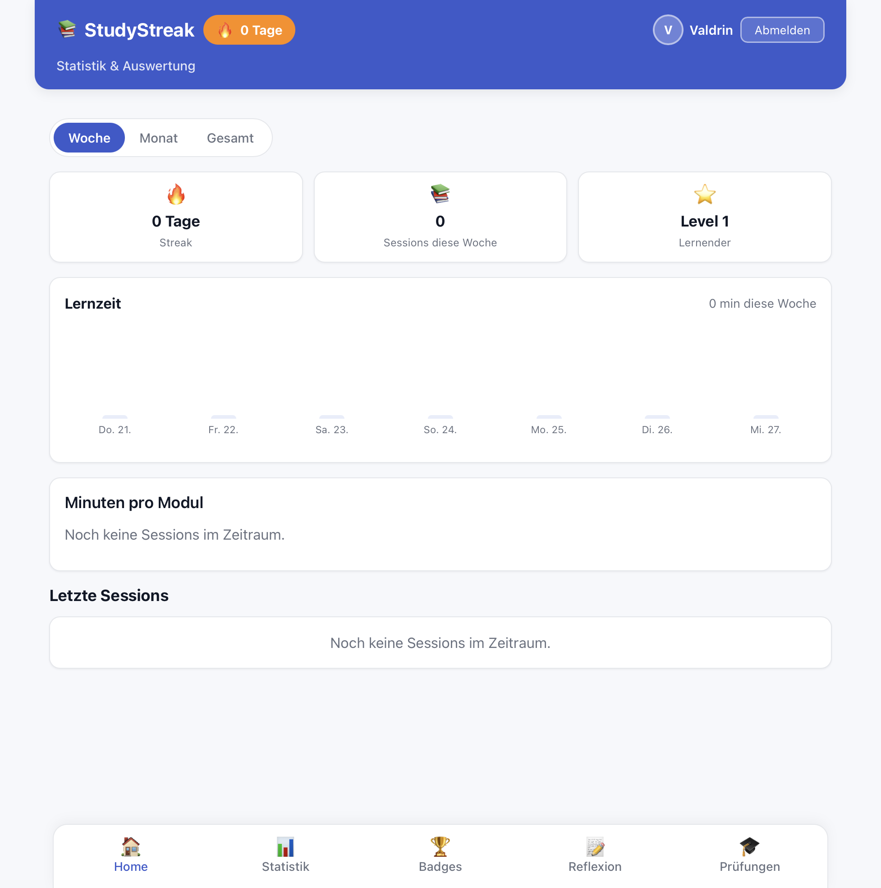
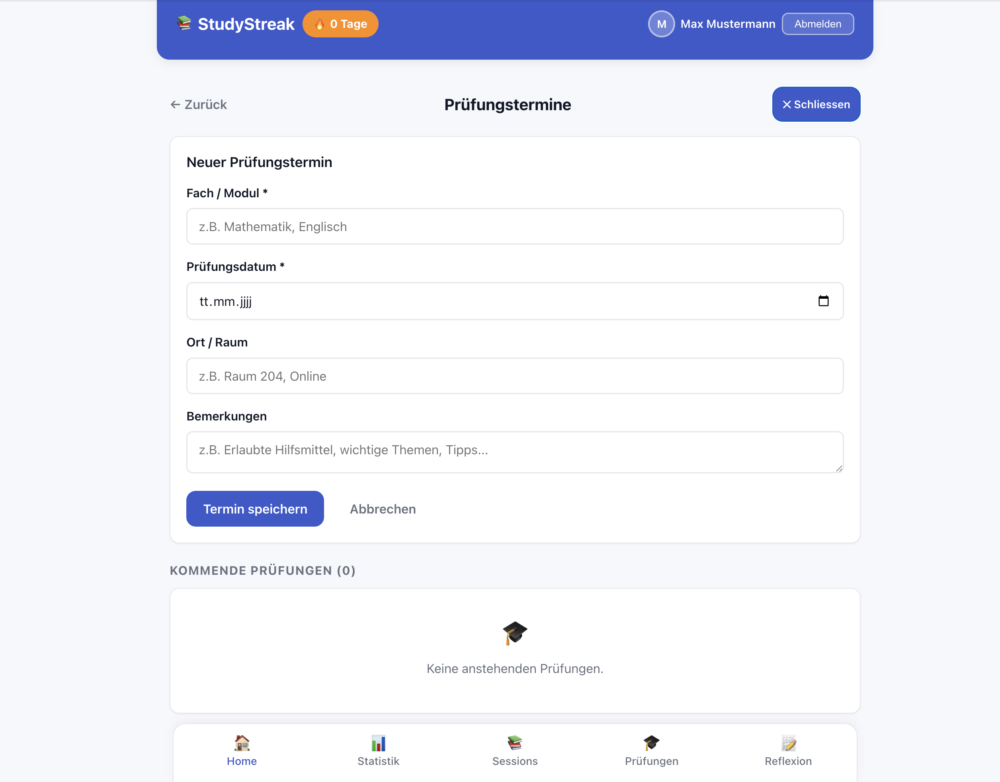
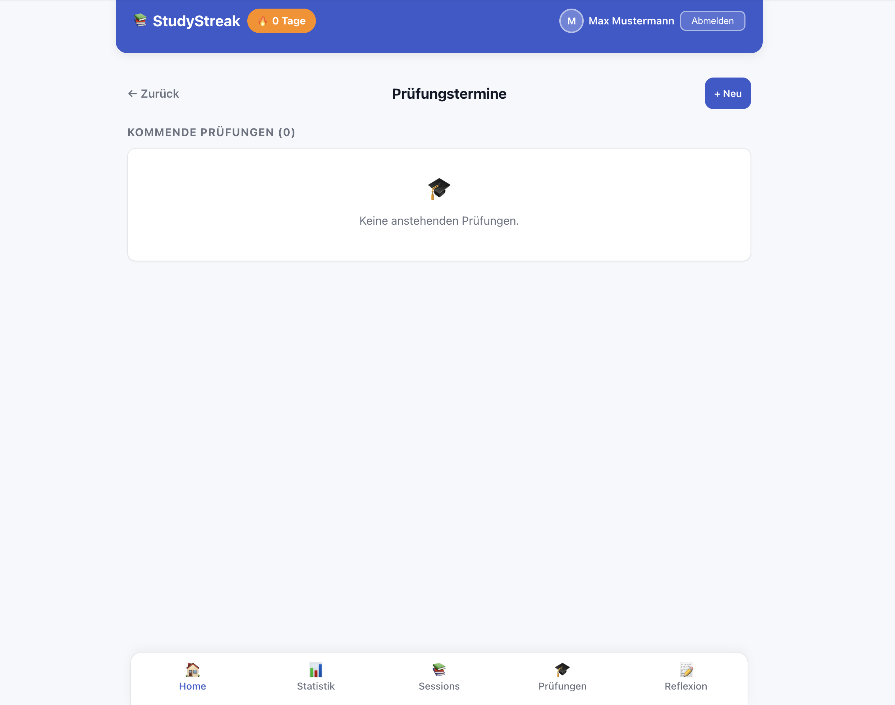

# Projektdokumentation - StudyStreak

> **Live-Demo:** https://study-streak.netlify.app  
> **Repository:** https://github.com/dalipivaldrin/studystreak  
> **Projektstart:** Februar 2026 | **Fertigstellung:** Mai 2026

---

## Inhaltsverzeichnis

1. [Ausgangslage](#1-ausgangslage)
2. [Lösungsidee](#2-lösungsidee)
3. [Vorgehen & Artefakte](#3-vorgehen--artefakte)
   1. [Understand & Define](#31-understand--define)
   2. [Sketch](#32-sketch)
   3. [Decide](#33-decide)
   4. [Prototype](#34-prototype)
   5. [Validate](#35-validate)
4. [Erweiterungen](#4-erweiterungen)
5. [Projektorganisation](#5-projektorganisation)
6. [KI-Deklaration](#6-ki-deklaration)
7. [Anhang](#7-anhang)

---

## 1. Ausgangslage

### Problem
Studierende im ersten Studienjahr an der ZHAW müssen parallel mehrere Module (Prototyping, ITPM, Statistik, Englisch u. a.) bearbeiten. Ein häufig beobachtetes Muster: In den ersten Wochen des Semesters wird wenig konsistent gelernt, kurz vor den Prüfungen entsteht eine chaotische, stressige Last-Minute-Phase. Die Lernpsychologie (Spacing Effect nach Ebbinghaus) zeigt, dass **verteiltes Lernen signifikant bessere Langzeitergebnisse liefert als Cramming** – dieses Wissen wird jedoch selten umgesetzt, weil ein einfaches, niedrigschwelliges Werkzeug fehlt, um Lerngewohnheiten zu etablieren und kleine tägliche Erfolge sichtbar zu machen.

### Ziele
- **Regelmässiges, verteiltes Lernen fördern** durch Gamification-Elemente (Streaks, Level, Badges)
- **Lernsessions in unter 30 Sekunden erfassen** können (niedrigschwelliger Einstieg)
- **Lernverhalten sichtbar machen** (Statistiken, Wochenziele pro Modul)
- **Intrinsische Motivation stärken** durch sichtbaren Fortschritt und Sofortbelohnung

### Primäre Zielgruppe
ZHAW-Studierende im 1.–3. Semester Informatik und Wirtschaftsinformatik, die mehrere Module parallel betreuen und ihren Lernfortschritt strukturieren möchten.

### Weitere Stakeholder
Selbstlernende ausserhalb der Hochschule (Sprachkurse, Weiterbildung), die von Habit-Tracking mit Modulbezug profitieren.

---

## 2. Lösungsidee

### Kernfunktionalität

**Session-Logging (Hauptworkflow)**
- Formular mit Modul, Datum, Dauer (Minuten), Thema, Fokus-Rating (1–5) und optionalen Notizen
- Vollständige CRUD-Operationen (Anlegen, Bearbeiten, Löschen)
- Hochoptimiert für Schnelligkeit: ≤ 3 Taps, ≤ 30 Sekunden

**Dashboard & KPIs**
- Aktuelle Streak-Anzeige (Tage in Folge)
- Level mit Fortschrittsbalken (1 Level = 300 Minuten Lernzeit)
- Wochenminuten (Ziel: 300 min/Woche)
- Liste der letzten 5 Sessions mit Editierbarkeit

**Tägliche Reflexion**
- Stimmungs-Rating (1–5)
- Zwei Freitextfelder: „Was lief gut?" und „Was will ich verbessern?"
- Genau ein Eintrag pro Tag (Upsert-Logik)

**Statistik-Seite**
- Balkendiagramm: Lernzeit pro Tag
- Filter: Woche / Monat / Gesamt
- Modul-Aufschlüsselung (farbcodiert)

**Gamification: Streak, Level, Badges**
- **Streak:** Konsekutive Tage mit mindestens einer Session. Setzt sich zurück, wenn letzte Session älter als gestern ist.
- **Level:** Floor(Gesamtminuten / 300) + 1
- **7 Badges:** Regelbasiert, z. B. „3-Tage-Streak", „10 Stunden", „50 Sessions", etc.

**Prüfungstermin-Verwaltung**
- Verwaltung anstehender Prüfungen mit Fach, Datum, Ort, Bemerkungen
- Dashboard zeigt die nächsten 3 Prüfungen mit Dringlichkeitsfarbcodes (rot ≤ 3 Tage, orange ≤ 7 Tage, grün > 7 Tage)

### Annahmen
Wenn das Dokumentieren fast nichts kostet (< 30 Sekunden) und der Fortschritt sofort sichtbar wird, entsteht eine stabile Lerngewohnheit, die in langfristige akademische Erfolge mündet.

### Abgrenzung (Out of Scope)
- **Kein Live-Pomodoro-Timer** – andere Apps lösen das besser; StudyStreak dokumentiert retrospektiv
- **Kein soziales Netzwerk** – keine Freundeslisten, keine öffentlichen Rankings
- **Keine Task-Management-App** – StudyStreak denkt in Sessions, nicht in einzelnen Tasks
- **Keine Authentifizierung/Nutzer-Accounts** – MVP für diese Prototyping-Phase auf Single-User ausgelegt

### Vergleich mit Alternativen

| Tool | Fokus | Stärke | Schwäche für unsere Zielgruppe |
|---|---|---|---|
| Notion | Sehr flexibler Workspace | Universell | Keine Lern-Spezialisierung, hohe Einstiegshürde |
| Habitica | Allgemeines Habit-Tracking + Gamification | Motivationssystem | Kein Fach- oder Modulbezug |
| Forest / Flora | Live-Timer während des Lernens | Fokus-Unterstützung | Löst nicht das Reflektieren & Dokumentieren nach der Session |
| **StudyStreak** | **Retrospektives Logging mit Modulbezug** | **Schnell, zielgruppenspezifisch, motivierend** | – |

---

## 3. Vorgehen & Artefakte

Die Durchführung erfolgt phasenbasiert nach der im Modul behandelten Methodik: **Design Sprint** kombiniert mit **Human-Centered Design (ISO 9241-210)**.

### 3.1 Understand & Define

**Zielgruppenverständnis**

*Proto-Persona: Valdrin*
- **Alter:** 22 Jahre
- **Rolle:** Informatik-Student im 1. Semester an der ZHAW
- **Situation:** Muss parallel mehrere Module betreuen (Prototyping, ITPM, Statistik, Englisch)
- **Verhalten:** Lernt unregelmässig, vergisst oft was er wann gelernt hat
- **Motivation:** Nutzt bereits Apps wie Duolingo und schätzt den Streak-Mechanismus
- **Bedürfnis:** Schnelle, nicht ablenkende Lösung ohne zusätzliche Overhead

**Recherche & Erkenntnisse**
- **Kurz-Interviews:** Mit Mitstudierenden (n=3) wurden die Lerngewohnheiten und Schmerzpunkte erhoben
- **Literatur:** Spacing Effect nach Ebbinghaus, Gamification-Psychologie (Duolingo-Studien)
- **Tool-Analyse:** Notion, Habitica, Forest/Flora – keine befriedigte den Spezialfall „Modul-Logging + Retrospektiv + Schnell"

**Wesentliche Erkenntnisse**
- ✅ Studierende wollen eine möglichst schnelle Erfassung (< 30 Sekunden) – die App soll nicht während des Lernens stören
- ✅ Sichtbarer Fortschritt (Streak, XP, Level-Balken) erhöht die Motivation nachweislich
- ✅ Modulbezogene Auswertungen sind relevanter als generelle Zeitstatistiken
- ✅ Retrospektives Logging (nach der Session) ist für den Alltag geeigneter als ein Live-Timer

### 3.2 Sketch

**Variantenüberblick (Crazy 8s)**

Im Rahmen der Design-Sprint-Methodik wurden **8 möglichst unterschiedliche Varianten** des Kernfeatures „Lernsession in < 30 Sekunden erfassen" skizziert (je 1 Minute pro Variante):

| # | Variante | Kurzbeschreibung | Vorteile | Nachteile |
|---|---|---|---|---|
| 1 | **Klassisches Formular** | Modul-Dropdown, Zahlen-Input für Dauer, Fokus-Slider, Speichern-Button | Vertraut | Viele Taps, Tastaturablenkung |
| 2 | **Preset-Tap (3 Taps)** | Modul-Chips, Dauer-Chips (15/30/45/60), Thema/Fokus optional, Speichern | ≤ 3 Taps, einhändig | Weniger Flexibilität |
| 3 | **Sprach-Eingabe** | Mikrofon-Screen: Speech-to-Text geparst und bestätigt | Sehr schnell | Unrealistisch in Bibliotheken, Akku |
| 4 | **Live-Timer mit Auto-Log** | Pomodoro-artiger Timer, nach Stop wird Session angelegt | Einfach | Widerspricht dem retrospektiven Konzept |
| 5 | **Chat-Bot** | Konversations-UI: Bot fragt nacheinander Modul, Dauer, Fokus | Spielerisch | Viele Tap-Sequenzen |
| 6 | **Swipe-Karten** | Pro Attribut eine Kartenspalte, die durchgewischt wird (Tinder-Style) | Modern | Zu viele Interaktionen |
| 7 | **Kalender-Drag** | Nutzer zieht einen Block im Tageskalender (Start/Ende = Dauer) | Intuitiv | Zu viele Gesten, Feinmotorik |
| 8 | **Home-Widget** | iOS-Widget mit Quick-Log-Tasten | Extrem schnell | Für MVP-Phase zu früh |

**Gewählte Variante:** **Variante 2 – Preset-Tap (3 Taps)**

**Skizzen:** 
- 

Diese Skizze zeigt die 8 Varianten handgezeichnet sowie die ausgearbeitete Happy-Path-Skizze der gewählten Variante 2 – drei aufeinanderfolgende Mobile-Screens, jeder Pfeil entspricht einem Tap.

### 3.3 Decide

**Gewählte Variante & Begründung: Variante 2 – Preset-Tap (3 Taps)**

Die Preset-Tap-Variante erfüllt das Kernversprechen am kompromisslosesten:

- **Geschwindigkeit:** Modul-Chip + Dauer-Chip + Speichern = 3 Taps, klar unter 30 Sekunden
- **Retrospektiv:** Kein Timer, keine Push-Notifikation während des Lernens – passt zur bewussten Entscheidung, dass die App nicht stören soll
- **Gamification-Anschluss:** Nach dem Speichern wird sofort Streak-/Badge-Rückmeldung auf einem eigenen Screen angezeigt – das ist der motivationale Kern
- **Mobile-first:** Keine Eingabefelder, die die Tastatur aufziehen – alles läuft über Chips und Sterne, auch einhändig bedienbar

**Abgelehnte Varianten:**
- V3 (Sprache) – in Bibliotheken unrealistisch, Datenschutz-Bedenken
- V4 (Live-Timer) – widerspricht dem retrospektiven Konzept und würde während des Lernens ablenken
- V6/V7 (Swipe, Kalender) – zu viele Interaktionen für < 30 s, erfordern hohe Präzision
- V8 (Widget) – für MVP-Phase zu früh, plattformabhängig

**End-to-End-Ablauf (Happy Path)**

1. **Dashboard öffnen:** Nutzer sieht Streak-Pill, Level-Balken, letzte 5 Sessions, nächste Prüfungen
2. **"+ Lernsession erfassen" antippen:** Navigiert zu `/sessions/new`
3. **Modul-Chip wählen:** z. B. „Statistik" (farblich gekennzeichnet, alphabetisch sortiert)
4. **Dauer-Chip wählen:** z. B. 45 Minuten (oder eigene Zeit eingeben)
5. **Optional:** Thema (Freitext, z. B. „Regression & ANOVA") und Fokus-Level (Sternebewertung 1–5)
6. **„Session speichern" antippen:** Bestätigungsscreen mit:
   - Streak-Update (z. B. „Dein Streak: 7 Tage! 🔥")
   - Evtl. neues Badge freigeschalten
   - Knopf „→ Zum Dashboard"
7. **Zurück auf Dashboard:** Session erscheint sofort in der Liste der letzten Sessions

**Alternative Workflows:**
- **Session bearbeiten/löschen:** Session-Karte antippen → `/sessions/[id]` → Edit- oder Delete-Button
- **Tägliche Reflexion:** Bottom-Nav → Reflexion-Tab → Stimmungs-Rating + Text eintragen → Speichern
- **Statistiken einsehen:** Bottom-Nav → Statistik-Tab → Woche/Monat/Gesamt auswählen → Balkendiagramm + Modul-Aufschlüsselung sehen

**Mockup**

🔗 [Figma Prototyp: StudyStreak – Mockup Übung 10](https://www.figma.com/design/j1DknvMCZSoX9RgQLrpkPB/StudyStreak-–-Mockup-Übung-10?node-id=0-1&p=f&t=coYxhbbPBmVZmKVS-0)

Der interaktive Prototyp umfasst 6 verlinkte Screens:
- Home (Dashboard mit KPIs)
- Modul wählen
- Dauer & Details
- Gespeichert (Bestätigungsscreen)
- Statistik (Balkendiagramm)
- Reflexion (Stimmung + Text)

Dieser Prototyp diente als **direkte Gestaltungsgrundlage** für die Implementierung und wurde mit echten Daten-Mustern durchgespielt, um Usability-Probleme frühzeitig zu erkennen.

---

### 3.4 Prototype

#### 3.4.1 Design (Entwurf)

**Informationsarchitektur**

```
Home (Dashboard)
├─ Streak-Pill (Header)
├─ KPI-Kacheln: Sessions, Level, Wochenminuten, nächste Prüfungen
├─ Letzte 5 Sessions (klickbar)
└─ + Lernsession erfassen (Button)

Lernsession erfassen (/sessions/new)
├─ Modul-Chips (mit Farbcode)
├─ Dauer-Presets (15/30/45/60 min oder Custom)
├─ Thema (optional, Freitext)
├─ Fokus-Rating (optional, 1–5 Sterne)
└─ Session speichern (Button)

Session gespeichert (Bestätigungsscreen)
├─ Grünes Häkchen-Icon (Erfolgsbestätigung)
├─ Streak-Update (z. B. „Dein Streak: 7 Tage!")
├─ Badge-Notification (falls neu freigeschalten)
└─ → Zum Dashboard (Link)

Session Detail & Edit (/sessions/[id])
├─ Alle Felder editierbar (Modul, Dauer, Thema, Fokus, Notizen)
├─ Bearbeiten-Button
├─ Löschen-Button
└─ ← Zurück zum Dashboard (Link)

Statistik (/stats)
├─ Tab-Filter: Woche / Monat / Gesamt
├─ Balkendiagramm: Lernzeit pro Tag (SVG)
├─ Modul-Aufschlüsselung (Farbcodes, Summen)
└─ Wochenziel-Fortschrittsbalken

Tägliche Reflexion (/reflection)
├─ Stimmungs-Rating (1–5, interaktiv)
├─ „Was lief gut?" (Freitext, max. 1000 Zeichen)
├─ „Was will ich verbessern?" (Freitext, max. 1000 Zeichen)
└─ Speichern-Button (Upsert pro Tag)

Badge-Galerie (/badges)
├─ 7 Badges in 2x4-Grid
├─ Freigeschalten: Farbig + Beschreibung
├─ Gesperrt: Graustufen + „Noch nicht erreicht"
└─ Hover-Info mit Bedingungen

Prüfungstermine (/exams)
├─ Formular: Fach, Datum, Ort, Bemerkungen
├─ Liste: Bevorstehend (mit Countdown) / Vergangen (archiviert)
└─ Edit & Delete pro Prüfung
```

**Wichtigste Screens der fertigen App**

| Screen | Beschreibung |
|--------|-------------|
|  | **Dashboard:** Streak-Pill im Header (z. B. 7 Tage), KPI-Kacheln (Sessions, Level, Wochenminuten), Fortschrittsbalken zum nächsten Level, Liste der letzten 5 Sessions mit Click-to-Edit. |
|  | **Session erfassen:** Modul-Chips (farblich nach Modul), Dauer-Presets (15/30/45/60 min oder custom), optionaler Freitext für Thema, Fokus-Rating (1–5 Sterne), Speichern-Button. |
|  | **Statistik-Seite:** Tab-Filter (Woche/Monat/Gesamt), Balkendiagramm Lernzeit/Tag (SVG, handgezeichnet), Modul-Aufschlüsselung (farbig mit Summen). |
|  | **Tägliche Reflexion:** Stimmungs-Rating (1–5, interaktiv), zwei Freitextfelder, Speichern-Button, Erfolgsbestätigung. |
|  | **Prüfungstermin-Formular:** Felder für Fach, Datum, Ort, Bemerkungen, Speichern-Button. |
|  | **Prüfungsliste:** Bevorstehend (mit Dringlichkeitsfarbcodes: rot ≤ 3 Tage, orange ≤ 7 Tage, grün > 7 Tage) und Vergangen (archiviert), Edit & Delete pro Eintrag. |

**Designentscheidungen**

- **Mobile-First Layout:** Optimiert für Smartphone (max-width 480 px). Lernen findet mobil und spontan statt; Daumen-Zone-Freundlichkeit ist kritisch.
- **Bottom Navigation:** Etabliertes Muster für Mobile Apps (4 Tabs: Home, Statistik, Badges, Reflexion). Alle Hauptbereiche mit dem Daumen erreichbar ohne die App neu zu greifen.
- **Chip-Buttons für Modulwahl & Dauer:** Schnelles Antippen ohne Tastatur-Ablenkung; auch einhändig bedienbar. Farbliche Codierung macht Module schnell erkennbar.
- **Gamification prominent platziert:** Streak immer im Header sichtbar; Erfolgsmeldung nach dem Speichern als grüner Bestätigungsscreen mit Badge-Benachrichtigung.
- **Farbkonzept:** 
  - Primary Blue `#3A5ACC` – Buttons, Links, Header
  - Streak Orange `#FF8C00` – Streak-Pill, Erfolgsfarben
  - Success Green `#28A745` – Bestätigung, Speichern
  - Modul-Farben: Prototyping = Violett, ITPM = Grün, Statistik = Gelb, Englisch = Rot
- **SVG-Balkendiagramm statt externe Charting-Lib:** Volle Designkontrolle, kein zusätzlicher Build-Overhead, performant für kleine Datenmengen.
- **Progressive Enhancement:** Alle CRUD-Aktionen funktionieren über SvelteKit Form Actions – auch ohne JavaScript bedienbar.
- **Datenvalidierung serverseitig:** Alle Eingaben werden auf dem Server überprüft (Pflichtfelder, Längenlimits, Datumsplausibilität). Fehler werden feldweise angezeigt; eingegebene Werte bleiben erhalten.

#### 3.4.2 Umsetzung (Technik)

**Technologie-Stack**
- **Frontend:** Svelte 4 (via SvelteKit 2)
- **Backend:** SvelteKit (Node.js auf Netlify Functions)
- **Styling:** Handgeschriebenes CSS mit CSS-Variablen (keine externe Lib)
- **Datenbank:** MongoDB Atlas (Free-Tier M0)
- **Hosting:** Netlify mit `@sveltejs/adapter-netlify`
- **Build-Tool:** Vite
- **IDE:** VS Code mit GitHub Copilot (KI-Unterstützung dokumentiert in Kap. 6)

**Tooling**
- **Figma:** Mockup & Prototyping (siehe Kap. 3.3)
- **GitHub:** Version Control, Issues zur Nachverfolgung von Evaluations-Findings
- **MongoDB Compass:** Lokale DB-Verwaltung während Entwicklung

**Struktur & Komponenten**

```
src/
├── app.css                              ← Globales CSS mit Design-Tokens
├── app.html                             ← HTML-Shell
├── hooks.server.js                      ← Server-Hooks (Request-Logging)
├── lib/
│   ├── constants.js                     ← Module, Badges, Konstanten
│   ├── server/
│   │   └── db.js                        ← MongoDB-Client (Singleton-Pool)
│   ├── utils/
│   │   ├── gamification.js              ← Streak, Level, Badge-Berechnung
│   │   └── validation.js                ← Server-Validierung (validateSession, validateReflection)
│   └── components/
│       ├── BottomNav.svelte             ← Navigation (4 Tabs)
│       ├── StreakDisplay.svelte         ← Streak-Pill
│       ├── StatBadge.svelte             ← KPI-Kachel
│       ├── SessionCard.svelte           ← Session-Kartenelement
│       ├── LevelProgress.svelte         ← Level-Fortschrittsbalken
│       ├── BadgeCard.svelte             ← Badge-Kartenelement
│       └── BarChart.svelte              ← SVG-Balkendiagramm
└── routes/
    ├── +layout.svelte                   ← App-Header, Bottom-Nav, Slot
    ├── +layout.server.js                ← Globale Stats für Header (Streak, Level)
    ├── +page.svelte                     ← Dashboard
    ├── +page.server.js
    ├── +error.svelte                    ← Error-Handling
    ├── sessions/
    │   ├── new/
    │   │   ├── +page.svelte             ← Session erfassen
    │   │   └── +page.server.js          ← Form Action: createSession
    │   └── [id]/
    │       ├── +page.svelte             ← Session Detail + Edit + Delete
    │       └── +page.server.js          ← Form Actions: updateSession, deleteSession
    ├── stats/
    │   ├── +page.svelte                 ← Statistik-Seite mit Filter
    │   └── +page.server.js              ← Aggregation nach Zeitraum & Modul
    ├── badges/
    │   ├── +page.svelte                 ← Badge-Galerie
    │   └── +page.server.js
    ├── reflection/
    │   ├── +page.svelte                 ← Tägliche Reflexion (Upsert)
    │   └── +page.server.js              ← Form Action: upsertReflection
    └── exams/
        ├── +page.svelte                 ← Prüfungstermin-Verwaltung
        └── +page.server.js              ← CRUD für Prüfungen
```

**Daten & Schnittstellen**

*Collections in MongoDB Atlas:*

```javascript
// sessions: Lernsessions
{
  _id: ObjectId,
  module: String,         // "prototyping" | "itpm" | "statistik" | "englisch"
  duration: Number,       // Minuten (1–480)
  date: Date,             // Wann wurde gelernt? (nicht in Zukunft)
  topic: String,          // Optional (max 200 Zeichen)
  focus: Number,          // Optional (1–5 Sterne)
  notes: String,          // Optional (max 500 Zeichen)
  createdAt: Date,
  updatedAt: Date
}

// reflections: Tägliche Reflexion
{
  _id: ObjectId,
  dateKey: String,        // "YYYY-MM-DD" (unique index → 1 Eintrag/Tag)
  mood: Number,           // 1–5
  wentWell: String,       // Optional (max 1000 Zeichen)
  improve: String,        // Optional (max 1000 Zeichen)
  date: Date,
  createdAt: Date,
  updatedAt: Date
}

// exams: Prüfungstermine
{
  _id: ObjectId,
  subject: String,        // Fach (max 100 Zeichen)
  examDate: Date,         // Prüfungsdatum
  location: String,       // Ort (optional, max 200 Zeichen)
  notes: String,          // Bemerkungen (optional, max 500 Zeichen)
  createdAt: Date,
  updatedAt: Date
}
```

**Validierung (Server-seitig)**

Jede Form Action ruft `validateSession()` oder `validateReflection()` auf:

```javascript
// validateSession:
- module: erforderlich, muss in zulässiger Liste sein
- duration: erforderlich, Zahl 1–480
- date: erforderlich, nicht in Zukunft
- topic: optional, max 200 Zeichen
- focus: optional, 1–5
- notes: optional, max 500 Zeichen

// validateReflection:
- mood: erforderlich, 1–5
- wentWell: optional, max 1000 Zeichen
- improve: optional, max 1000 Zeichen
```

Fehler werden als `fail(400, { errors, values })` an die Seite zurückgegeben und dort **feldweise angezeigt**; eingegebene Werte bleiben im Formular erhalten (für schnelle Korrektur).

**Gamification-Logik** (src/lib/utils/gamification.js)

- **Streak:** 
  - Definition: Konsekutive Tage mit mindestens einer Session
  - Logik: Berechnet aus Sessions; wenn letzte Session älter als gestern, reset zu 0
  - Edge-Case: Mitternacht – werden Tag-Grenzen korrekt berücksichtigt?
  - Implementierung: Wird bei jedem Request neu berechnet

- **Level:**
  - Definition: 1 Level = 300 Minuten Gesamtlernzeit
  - Formel: `Level = floor(totalMinutes / 300) + 1`
  - Display: Fortschrittsbalken zeigt Verbrauchte Minuten im aktuellen Level

- **7 Badges:** Erreicht, wenn:
  1. **3-Tage-Streak** – Streak ≥ 3
  2. **Eine Woche** – Streak ≥ 7
  3. **10 Stunden** – totalMinutes ≥ 600
  4. **50 Sessions** – Anzahl Sessions ≥ 50
  5. **Meister** – totalMinutes ≥ 1500 (5 Level)
  6. **Perfektionismus** – Alle Sessions haben Fokus ≥ 4
  7. **Reflexionsfreund** – 20 Reflektions-Einträge

**Deployment**

- **Hosting:** Netlify mit `@sveltejs/adapter-netlify`
- **Build-Befehl:** `npm run build`
- **Publish-Verzeichnis:** `build`
- **Umgebungsvariablen:** `MONGODB_URI` (wird im Netlify-Dashboard hinterlegt)
- **Live-URL:** https://study-streak.netlify.app
- **Cold-Start-Optimierung:** MongoDB-Client wird als Singleton-Promise gehalten und zwischen Aufrufen wiederverwendet

**Lokale Entwicklung**

```bash
# 1. Repository klonen
git clone https://github.com/dalipivaldrin/studystreak
cd studystreak

# 2. Abhängigkeiten installieren
npm install

# 3. .env-Datei anlegen (Vorlage: .env.example)
cp .env.example .env
# → MONGODB_URI mit deinem MongoDB-Atlas-String eintragen

# 4. Dev-Server starten
npm run dev
# → App läuft auf http://localhost:5173

# 5. Type-Check nach Änderungen an .svelte-Dateien
npm run check

# 6. Production-Build lokal testen
npm run build
npm run preview
```

**Besondere Entscheidungen & Trade-offs**

1. **Handgeschriebenes CSS statt UI-Framework:**
   - ✅ Volle Designkontrolle, kein Bloat
   - ✅ CSS-Variablen für Theme-Konsistenz
   - ⚠️ Mehr manuelle Arbeit, aber für MVP angemessen

2. **MongoDB statt SQLite:**
   - ✅ Serverless-Kompatibilität (Netlify)
   - ✅ Kein persistentes Filesystem nötig
   - ⚠️ Für Single-User etwas Overkill, aber skalierbar

3. **Form Actions statt Client-side Fetch:**
   - ✅ Funktioniert auch ohne JavaScript (Progressive Enhancement)
   - ✅ Reduzierte Komplexität (keine separate API)
   - ✅ Automatische CSRF-Protection in SvelteKit

4. **Streak/Level/Stats nicht in DB persistiert:**
   - ✅ Eine einzige Quelle der Wahrheit (Sessions)
   - ✅ Keine Inkonsistenzen möglich
   - ⚠️ Berechnung bei jedem Request, aber für diese Datenmengen negligible

5. **Single-User (keine Authentifizierung):**
   - ✅ Einfacher MVP für Prototyping-Phase
   - ⚠️ Für Production würde User-Isolation nötig sein

---

### 3.5 Validate

**URL der getesteten Version:** https://study-streak.netlify.app (getestet am **14. Mai 2026**)

**Ziele der Prüfung**
1. Ist der Kernworkflow „Lernsession in unter 30 Sekunden erfassen" ohne Anleitung auffindbar und durchführbar?
2. Funktioniert die Bearbeitung einer bereits gespeicherten Session intuitiv?
3. Ist die tägliche Reflexion selbsterklärend?
4. Findet die Testperson die Wochenstatistik ohne Hilfe?
5. Sind die Gamification-Elemente (Streak, Level) motivierend?

**Vorgehen**
- **Methode:** Moderierter Thinking-Aloud-Usability-Test
- **Setting:** On-site (ZHAW-Atelier)
- **Dauer:** ~20 Minuten pro Testperson
- **Protokollierung:** Beobachtungsformular mit Feedback-Grid
- **Dokumentation:** [docs/usability-test-skript.md](docs/usability-test-skript.md)

**Stichprobe**
- **1 Testperson:** Marko Vukcevic (22 Jahre, Informatik-Student, 1. Semester)
- **Profil:** Kennt Habit-Tracking-Apps (Duolingo), hat StudyStreak vor dem Test nicht gesehen
- **Auswahlkriteria:** Repräsentativ für die Zielgruppe (Student, parallele Module, Gamification-Affinität)

**Aufgaben & Szenarien**

> **Ausgangslage:** Sie sind Informatik-Student im ersten Semester und möchten Ihre Lerngewohnheiten verbessern. Sie haben heute 45 Minuten für Statistik gelernt und möchten das festhalten.

**Aufgabe 1:** Session erfassen
- **Task:** „Erfassen Sie in der App, dass Sie heute 45 Minuten für Statistik gelernt haben."
- **Erfolgskriterium:** Session erscheint auf dem Dashboard innerhalb von 30 Sekunden
- **Ergebnis:** ✅ Abgeschlossen in ~22 Sekunden

**Aufgabe 2:** Session bearbeiten
- **Task:** „Sie haben sich geirrt – es waren eigentlich 60 Minuten. Korrigieren Sie die Session."
- **Erfolgskriterium:** Geänderte Dauer (60 min) wird auf dem Dashboard angezeigt
- **Ergebnis:** ⚠️ Abgeschlossen mit Umweg (~45 Sekunden)

**Aufgabe 3:** Tägliche Reflexion
- **Task:** „Tragen Sie eine kurze Reflexion ein. Heute hat alles gut geklappt (Stimmung 5)."
- **Erfolgskriterium:** Reflexion wird gespeichert und ist abrufbar
- **Ergebnis:** ✅ Abgeschlossen problemlos

**Aufgabe 4:** Statistiken ansehen
- **Task:** „Wie viele Minuten haben Sie diese Woche insgesamt gelernt?"
- **Erfolgskriterium:** Statistik-Seite wird gefunden, Werte werden korrekt interpretiert
- **Ergebnis:** ✅ Abgeschlossen

**Beobachtungen pro Task**

| Task | Status | Beobachtung | Zeitbedarf |
|---|---|---|---|
| T1 – Session erfassen | ✅ Erfolg | Modul-Chips sofort verstanden. Dauer-Presets intuitiv. Kein Zögern beim Speichern. | ~22s |
| T2 – Session bearbeiten | ⚠️ Erfolg mit Umweg | Suchte zuerst auf Dashboard nach Edit-Button direkt auf Session-Karte, fand keinen sofort. Musste die Karte antippen, um zur Detail-Ansicht zu gelangen. Nach Umlenkung: schnelle Bearbeitung. | ~45s |
| T3 – Reflexion | ✅ Erfolg | Bottom-Nav-Einstieg sofort klar. Stimmungs-Rating (1–5) intuitiv. Text-Eingabe smooth. | ~30s |
| T4 – Stats | ✅ Erfolg | Stats-Tab sofort gefunden. Balkendiagramm korrekt interpretiert. Woche/Monat/Gesamt-Filter verstanden. | ~15s |

**Feedback-Grid** (Marko Vukcevic)

| ✅ Was hat gut funktioniert? | ❌ Was hat nicht funktioniert / gestört? | 💡 Neue Ideen |
|---|---|---|
| ✅ Chip-Auswahl für Modul und Dauer ist sehr schnell und intuitiv | ❌ Session-Karte auf dem Dashboard ist nicht klickbar – Bearbeitung erfordert Umweg | 💡 Session-Karte direkt klickbar machen → Edit-Ansicht |
| ✅ Streak-Counter auf dem Dashboard ist motivierend | ❌ Nach dem Speichern war der „← Zurück"-Link zu klein und kaum sichtbar | 💡 Deutlicherer CTA-Button „→ Zum Dashboard" |
| ✅ Farbliche Modul-Kennzeichnung hilft bei der Orientierung | ❌ Tab-Label „Stats" zu generisch – nicht sofort klar, was sich dahinter verbirgt | 💡 Label zu „Statistik" ändern |
| ✅ App läuft auch auf dem Smartphone gut | ✅ (Keine größeren Usability-Probleme) | 💡 Optional: Wochenziel-Widget oben auf Stats-Seite |
| ✅ Level-Fortschrittsbalken motivierend | | 💡 Optional: Onboarding-Tour beim ersten Start |

**Zusammenfassung der Resultate**

Der **Kernworkflow (Aufgabe 1) wurde in ~22 Sekunden** und **ohne Hilfe abgeschlossen** – das Kernziel von **unter 30 Sekunden ist erreicht**. 

Die Workflows für Reflexion und Statistiken funktionieren ebenfalls problemlos. Die **grösste Schwachstelle ist die fehlende Direktnavigation** von der Session-Karte auf dem Dashboard zur Bearbeitungsansicht (Aufgabe 2).

**Testperson's Fazit:** „Die App ist schnell und macht Spass. Der Streak motiviert mich, täglich zu lernen. Die Darstellung ist klar. Ich würde sie nutzen."

**Abgeleitete Verbesserungen (Prioritäten)**

| Priorität | Massnahme | Begründung | Status |
|---|---|---|---|
| **Hoch** | Session-Karte auf Dashboard klickbar → direkt zu Detail-/Edit-Ansicht ([Issue #2](https://github.com/dalipivaldrin/studystreak/issues/2)) | T2: Testperson erwartete Direktnavigation | ✅ Umgesetzt |
| **Hoch** | Auf dem „Session gespeichert"-Screen deutlicherer CTA-Button „→ Zum Dashboard" einfügen ([Issue #1](https://github.com/dalipivaldrin/studystreak/issues/1)) | Link „← Zurück" war zu wenig sichtbar | ✅ Umgesetzt |
| **Mittel** | Tab-Label von „Stats" zu „Statistik" ändern ([Issue #3](https://github.com/dalipivaldrin/studystreak/issues/3)) | Tab-Bezeichnung war zu generisch | ✅ Umgesetzt |
| **Gering** | Wochenziel-Widget auf der Stats-Seite weiter oben platzieren | Bessere Sichtbarkeit des Fortschritts | ⏳ Für nächste Phase |
| **Gering** | Kurzes Onboarding-Overlay beim ersten App-Start | Allgemeine Orientierung für neue Nutzer | ⏳ Für nächste Phase |

**Impact der umgesetzten Massnahmen**
- Issue #1 & #2: **direkter Impact auf T2-Erfolgsquote** (von Umweg zu direkter Navigation)
- Issue #3: **verbesserte Klarheit** der Navigation
- Alle 3 Issues in Commits verknüpft: [`#1`](https://github.com/dalipivaldrin/studystreak/commit/?q=1), [`#2`](https://github.com/dalipivaldrin/studystreak/commit/?q=2), [`#3`](https://github.com/dalipivaldrin/studystreak/commit/?q=3)

---

## 4. Erweiterungen

Folgende Erweiterungen gehen über den geforderten Mindestumfang hinaus und wurden basierend auf Evaluations-Findings oder zur Verbesserung der Robustheit implementiert:

### 4.1 Session-Karte auf Dashboard klickbar (Edit-Flow)

- **Beschreibung & Nutzen:** Session-Karten auf dem Dashboard sind direkt klickbar und führen zur Detail-/Bearbeitungsansicht. Reduziert Navigationsschritte für den häufigen Use Case „Session nachträglich korrigieren" und verbessert die Usability erheblich.
- **Wo umgesetzt:**
  - **Frontend:** `src/routes/+page.svelte` (SessionCard als Link zu `/sessions/[id]`)
  - **Backend:** `src/routes/sessions/[id]/+page.svelte` (Edit- und Delete-Formular), `+page.server.js` (Form Actions)
- **Aus Evaluation abgeleitet?** **Ja** – Marko Vukcevic suchte direkt auf der Session-Karte nach einem Bearbeitungs-Button und fand keinen (T2). Angelegt als GitHub Issue #2, sofort umgesetzt.

### 4.2 Statistik-Seite mit interaktiven Filtern und SVG-Diagramm

- **Beschreibung & Nutzen:** Die Statistik-Seite zeigt ein Balkendiagramm der Lernzeit pro Tag, filterbar nach Woche / Monat / Gesamt. Zusätzlich eine Modul-Aufschlüsselung mit Farbcodes. Ermöglicht Studierenden, Lernmuster zu erkennen und schwächere Module gezielt zu fördern.
- **Wo umgesetzt:**
  - **Frontend:** `src/routes/stats/+page.svelte` (Tab-Filter, Diagramm-Rendering), `src/lib/components/BarChart.svelte` (SVG-Balkendiagramm, handgezeichnet)
  - **Backend:** `src/routes/stats/+page.server.js` (Aggregation der Sessions nach Zeitraum und Modul)
- **Technische Highlights:**
  - SVG-Diagramm ohne externe Charting-Lib (volle Kontrolle, niedrige Komplexität)
  - Responsive Scaling basierend auf Daten-Maxima
  - Farbcodierung nach Modul für schnelle Mustererkennung
- **Aus Evaluation abgeleitet?** Nein – war von Anfang an Teil des Konzepts (User Journey Schritt 7).

### 4.3 Gamification-Pipeline (Streak, Level, Badges)

- **Beschreibung & Nutzen:** Eine dedizierte Logik-Bibliothek berechnet:
  - **Streak:** Konsekutive Tage mit mindestens einer Session (Reset wenn letzte Session älter als gestern)
  - **Level:** 1 Level = 300 Minuten (Formel: `floor(totalMinutes / 300) + 1`)
  - **7 Badges:** Regelbasiert (3-Tage-Streak, Eine Woche, 10 Stunden, 50 Sessions, Meister, Perfektionismus, Reflexionsfreund)
  
  Sichtbarer Fortschritt erhöht die Motivation und fördert das tägliche Zurückkehren zur App (Kernhypothese der Lösungsidee).

- **Wo umgesetzt:**
  - **Backend/Logik:** `src/lib/utils/gamification.js` (Streak-Algorithmus mit Edge-Case-Handling, Level-Berechnung, Badge-Auswertung)
  - **Frontend:** 
    - `src/lib/components/StreakDisplay.svelte` (Streak-Pill im Header)
    - `src/lib/components/LevelProgress.svelte` (Level + Fortschrittsbalken)
    - `src/lib/components/BadgeCard.svelte` (Badge-Kartenelement)
    - `src/routes/badges/+page.svelte` (Badge-Galerie mit 7 Badges)
  - **Dashboard:** `src/routes/+page.svelte` (zeigt Streak, Level, Wochenminuten)

- **Edge-Case-Handling:**
  - Streak setzt sich korrekt um Mitternacht zurück
  - Wochengrenze (Montag 00:00) wird korrekt berücksichtigt
  - Badges werden nur mit korrekten Schwellenwerten auslöst

- **Aus Evaluation abgeleitet?** Nein – war von Anfang an geplant. Marko kommentierte spontan positiv über den Streak-Counter.

### 4.4 Tägliche Reflexion (zweiter Workflow)

- **Beschreibung & Nutzen:** Eigener Workflow zur täglichen Selbstreflexion mit Stimmungs-Rating (1–5) und zwei Freitextfeldern („Was lief gut?" und „Was will ich verbessern?"). Genau ein Eintrag pro Tag (Upsert-Logik mit `dateKey` als natürlichem Schlüssel). Ergänzt das Session-Logging um eine qualitative Dimension und fördert Selbstreflexion.

- **Wo umgesetzt:**
  - **Frontend:** `src/routes/reflection/+page.svelte` (Formular mit Stimmungs-Rating und Text-Input)
  - **Backend:** `src/routes/reflection/+page.server.js` (Upsert per `dateKey`, Validierung)
  - **Datenbank:** MongoDB Collection `reflections` (unique Index auf `dateKey`)

- **Upsert-Logik:** 
  - Wenn noch keine Reflexion heute: neuer Eintrag
  - Wenn bereits vorhanden: Überschreiben (Update)
  - Nur ein Eintrag pro `YYYY-MM-DD`

- **Aus Evaluation abgeleitet?** Nein – war von Anfang an im Konzept als zweiter Workflow definiert.

### 4.5 Prüfungstermin-Verwaltung (Exams)

- **Beschreibung & Nutzen:** Eigene Route `/exams` zur Verwaltung von Prüfungsterminen. Studierende können anstehende Prüfungen mit Fach, Datum, Ort und Bemerkungen erfassen und löschen. Das Dashboard zeigt die nächsten 3 Prüfungen direkt als farbcodierte Dringlichkeitskarten (rot = ≤ 3 Tage, orange = ≤ 7 Tage, grün = > 7 Tage). Schafft Überblick über bevorstehende Prüfungen.

- **Wo umgesetzt:**
  - **Frontend:** `src/routes/exams/+page.svelte` (Formular, Upcoming/Past-Liste, Dringlichkeits-Farbcodes)
  - **Backend:** `src/routes/exams/+page.server.js` (CRUD via Form Actions), `src/lib/server/db.js` (getUpcomingExams)
  - **Dashboard:** `src/routes/+page.svelte` (Vorschau der nächsten 3 Prüfungen mit Countdown)
  - **Datenbank:** MongoDB Collection `exams`

- **Dringlichkeitslogik:**
  - Rot: Prüfung in ≤ 3 Tagen → hohe Dringlichkeit
  - Orange: Prüfung in ≤ 7 Tagen → mittlere Dringlichkeit
  - Grün: Prüfung > 7 Tage entfernt → geringe Dringlichkeit

- **Aus Evaluation abgeleitet?** Nein – erweitert die Zielgruppe und ergänzt das Session-Logging um Zielorientierung (bevorstehende Prüfungen als Motivation).

### 4.6 Komplexe serverseitige Validierung

- **Beschreibung & Nutzen:** Alle Formulare werden serverseitig validiert (Pflichtfelder, Längenlimits, Wertebereiche, Datumsplausibilität – kein Datum in der Zukunft). Feldweise Fehleranzeige mit Erhalt der eingegebenen Werte. Erhöht Robustheit und Nutzererlebnis erheblich.

- **Wo umgesetzt:**
  - **Backend:** `src/lib/utils/validation.js` (`validateSession`, `validateReflection`, `validateExam`), alle Form Actions in `+page.server.js`-Dateien
  - **Frontend:** Feldweise Fehleranzeige unterhalb des betroffenen Input-Feldes; Werte bleiben im Formular erhalten

- **Validierungsregeln:**
  - **Sessions:** module erforderlich, duration 1–480 min, date nicht in Zukunft, topic max 200 Zeichen, focus 1–5, notes max 500 Zeichen
  - **Reflections:** mood erforderlich (1–5), wentWell max 1000 Zeichen, improve max 1000 Zeichen
  - **Exams:** subject erforderlich, examDate erforderlich & nicht in Vergangenheit, location max 200 Zeichen, notes max 500 Zeichen

- **Aus Evaluation abgeleitet?** Nein – war aus technischen Qualitätsgründen von Anfang an geplant.

### 4.7 Progressive Enhancement (Form Actions ohne JavaScript)

- **Beschreibung & Nutzen:** Alle CRUD-Aktionen (Session erfassen, bearbeiten, löschen; Reflexion speichern; Prüfung erfassen) funktionieren vollständig über SvelteKit Form Actions – auch ohne JavaScript im Browser. Erhöht Zugänglichkeit und Robustheit erheblich.

- **Wo umgesetzt:**
  - **Frontend:** `use:enhance` in allen Formularen für OptimisticUI ohne JavaScript-Abhängigkeit
  - **Backend:** Form Actions in allen `+page.server.js`-Dateien (default import SvelteKit `actions`)

- **Technische Implementierung:**
  - Form `method="POST"` mit `<button type="submit">`
  - Server validiert und gibt `fail(400, { errors, values })` oder `redirect()`
  - Client re-hydrated UI mit neuen Daten

- **Aus Evaluation abgeleitet?** Nein – technische Designentscheidung für Robustheit.

### 4.8 Modulverwaltung (eigene Module anlegen)

- **Beschreibung & Nutzen:** (Geplant, nicht im MVP enthalten) Über `/modules` könnten Studierende eigene Lernmodule mit Namen, Kürzel und Farbe anlegen, die anschliessend beim Session-Erfassen als Chips auswählbar sind. Damit wäre die App nicht mehr auf vordefinierte Module beschränkt.

- **Status:** ⏳ Für nächste Iteration (Mindestumfang erfüllt)

---

## 5. Projektorganisation

### Repository & Struktur
- **URL:** https://github.com/dalipivaldrin/studystreak
- **Hosting:** GitHub (Repository öffentlich einsehbar für Dozierende)
- **Collaborators:** mmeisterhans, bkuehnis (als Dozierende hinzugefügt gemäss Aufgabenstellung)
- **Branch-Strategie:** Trunk-Based Development auf `main`. Feature-Arbeit erfolgt in kurzen lokalen Branches, gemergt mit Squash-Commits

### Issue-Management
- **GitHub Issues** für Bugs und Erweiterungs-Ideen
- **Verknüpfung mit Commits** via `Closes #<nr>`-Referenzen
- **Evaluations-Findings** werden als Issues angelegt und priorisiert:
  - Issue #1: Deutlicherer CTA auf Speichern-Screen ✅ Umgesetzt
  - Issue #2: Session-Karte klickbar ✅ Umgesetzt
  - Issue #3: Tab-Label „Statistik" statt „Stats" ✅ Umgesetzt

### Commit-Praxis
- **Format:** Sprechende Commit-Messages im Imperativ
- **Beispiele:**
  - `init: scaffold sveltekit + mongodb setup`
  - `feat: add session logging with module chips`
  - `feat: add gamification streak, level, badges`
  - `fix: streak calculation around midnight (issue #2)`
  - `refactor: extract validation logic to utils`
  - `docs: add usability test results`
- **Häufigkeit:** Nach jedem logischen Schritt (Feature, Fix, Docs)

---

## 6. KI-Deklaration

### 6.1 KI-Tools

**Eingesetzte Tools:**
- **Claude** (Anthropic, claude.ai) – Hauptwerkzeug für Code-Generierung, Dokumentation, Sparring
- **GitHub Copilot** (im VS Code) – Code-Vervollständigung, Snippets

### 6.2 Zweck & Umfang

**Übung 10 (Mockup & Ideenfindung):**
- Formulierung der Crazy-8s-Beschreibungen
- Sparringspartner für die Variantenbewertung
- Sprachliche Überarbeitung der Dokumentation
- Erstellung der README-Vorlage basierend auf Figma-Mockup

**Übung 11 (Prototyp & Implementierung):**
- Generierung des **SvelteKit-Grundgerüsts** (Routen-Struktur, Komponenten, MongoDB-Anbindung) auf Basis der vom Autor definierten Architektur
  - Vor KI: Architektur-Entscheidungen (Bottom-Nav, Module-System, Gamification-Logik) vom Autor
  - KI-Input: Skeleton-Code für alle Routes, Components, DB-Connection
  - Autor-Input: Code-Review, Anpassungen an spezifische Anforderungen, Integration in Repository
  
- Aufbau der **CSS-Design-Tokens** entlang des selbst erstellten Figma-Mockups
  - Vor KI: Farbkonzept, Layout-Grid vom Autor
  - KI-Input: CSS-Variablen-Struktur, responsive Breakpoints
  - Autor-Input: Fine-tuning, Mobile-optimierungen

- Sprachliche Glättung des Dokumentationsteils (README, Usability-Test-Protokoll)
  - Vor KI: Rohe Notizen, Beobachtungen vom Autor
  - KI-Input: Strukturierung, Kohärenz, Tonalität
  - Autor-Input: Fakten-Überprüfung, Spezifika

### 6.3 Eigene Leistung (Abgrenzung)

**Konzeptionell (100% Autor):**
- Projektidee, Zielgruppenanalyse
- Crazy-8s-Skizzen (Stift auf Papier) – alle 8 Varianten
- Variantenwahl (Preset-Tap) mit Begründung
- End-to-End-Ablauf (User Journey)
- Gamification-Logik: Regeln für Streak, Level, Badges
- Figma-Mockup mit allen 6 Screens
- Farbkonzept & Designentscheidungen
- Usability-Test: Durchführung, Beobachtungen, Auswertung

**Technisch (Autor mit KI-Unterstützung):**
- **Architektur:** Routen-Struktur, Datenmodell, Trennung von Business-Logic und UI (Autor)
- **Code:** KI hat Vorschläge gemacht, Autor hat:
  - ✅ Code gegenlesen
  - ✅ Angepasst an spezifische Anforderungen (z. B. Streak-Edge-Cases, Validierungs-Bedingungen)
  - ✅ Integriert ins Repository
  - ✅ Manuell getestet (lokaler Dev-Server, produktive URL)
- **Tests:** Edge-Case-Tests für Streak um Mitternacht, für Wochengrenze, für MongoDB-Connection-Pooling
- **Deployment:** MongoDB-Atlas-Setup, Netlify-Konfiguration, Umgebungsvariablen – vollständig Autor

### 6.4 Prompt-Vorgehen

**Allgemeiner Ansatz:**
- Kontext mitgeben: Aufgabenstellung, Mockup, vorige Entscheidungen
- Konkrete Anfragen stellen (nicht zu offen)
- Output überprüfen, Fehler korrigieren, iterieren

**Konkrete Beispiele:**

1. **Streak-Berechnung (Kritischer Bug):**
   - KI generierte: `if (lastSessionDate > yesterday) currentStreak++` ❌ Falsch (Mitternacht-Edge-Case)
   - Autor überprüfte: Fehler erkannt
   - Korrektur: `const yesterday = new Date(today); yesterday.setDate(yesterday.getDate() - 1);` und Vergleich auf Tag-Ebene ✅

2. **CSS-Responsive-Breakpoints:**
   - Autor vorgab: „Mobile-first, max-width 480px, Daumen-Zone-freundlich"
   - KI schlug vor: CSS-Variablen für spacing, flexbox-Grids
   - Autor übernahm: Anpassungen für Readability, Font-Sizes verfeinert

3. **README-Dokumentation:**
   - Autor gab Rohdaten: Testtranskripta, Screenshots
   - KI strukturierte: Tabellen, Klartext, Konsistenz
   - Autor überprüfte: Fakte korrekt? Terminologie konsistent? ✅ Ja

### 6.5 Reflexion über KI-Einsatz

**Nutzen:**
- ✅ **Schnelligkeit:** SvelteKit-Grundgerüst hätte Tage gedauert, ging in Stunden
- ✅ **Konsistenz:** CSS-Variablen, Component-Struktur einheitlich
- ✅ **Dokumentation:** Text fliesst besser, weniger Grammatikfehler

**Grenzen & Risiken:**
- ⚠️ **Code-Qualität:** KI-Code muss **kritisch überprüft** werden. Beispiele:
  - Falsche Behandlung des Streaks an Tagesgrenzen (Mitternacht)
  - Falsche ObjectId-Behandlung wenn Format ungültig
  - MongoDB-Client nicht gepoolt (Cold-Start-Probleme)
  - → Alle mussten vom Autor korrigiert werden
  
- ⚠️ **Verantwortung:** Inhaltliche und technische Verantwortung bleibt **allein beim Autor**
  - Code-Review ist Pflicht
  - Tests sind Pflicht (auch wenn KI Tests vorgeschlagen hat)
  - Deployment-Entscheidungen (MongoDB, Netlify) sind Autor-Entscheidungen

**Qualitätssicherung:**
- Manual Code Reviews (vor jedem Commit)
- Lokale Dev-Tests (npm run dev, Browser-Tests)
- Produktive Tests (deploy auf Netlify, Usability-Test mit Marko)

---

## 7. Anhang

### Projektmaterialien & Quellen

**Figma Mockup:**
- 🔗 [StudyStreak – Mockup Übung 10](https://www.figma.com/design/j1DknvMCZSoX9RgQLrpkPB/StudyStreak-–-Mockup-Übung-10?node-id=0-1&p=f&t=coYxhbbPBmVZmKVS-0)
- Interaktive Prototyp mit 6 verlinkten Screens (Home, Modul wählen, Dauer & Details, Gespeichert, Statistik, Reflexion)
- Wurde als direkte Gestaltungsgrundlage für die SvelteKit-Implementierung verwendet

**Artefakte aus Ideenfindung & Sketch:**
- 📄 [Ideenbeschreibung – Abgabe Woche 8](./docs/) (Valdrin Dalipi, FS 2026)
  - Kurze Problemanalyse, Zielgruppe, Lösungsidee (1–2 Seiten)
  
- 🎨 [Sketch-Dokumentation – Crazy 8s & Wireframes](docs/screenshots/07-prototypes-8variants.png) (Abgabe Woche 9)
  - 8 unterschiedliche Varianten handgezeichnet
  - Ausgearbeitete Happy-Path-Skizze der gewählten Variante (3 Screens)

**Evaluationsmaterialien:**
- 🧪 [Usability-Test-Skript & Resultate](docs/usability-test-skript.md)
  - 6 Aufgaben (T1–T4 in diesem README), Erfolgskriterien
  - Feedback-Grid mit Beobachtungen von Marko Vukcevic
  - Abgeleitete Verbesserungen (Priorisierung)

**Prototyp & Code:**
- 🚀 [Live-App](https://study-streak.netlify.app) – Produktive URL auf Netlify
- 💾 [GitHub Repository](https://github.com/dalipivaldrin/studystreak) – Kompletter Quellcode mit Git-History
- 📱 Screenshots unter `docs/screenshots/` – 6 App-Screens dokumentiert

**Dokumentation:**
- 📋 `README.md` – Diese Datei (vollständige Projektdokumentation nach Vorlage)
- 📄 `CLAUDE.md` – Projektkontext und Anforderungen (für interne Referenz)
- 📄 `ANFORDERUNGEN.md` – Erfüllungsstand aller Anforderungen (Selbstbewertung)

**Technische Referenzen:**
- [SvelteKit Dokumentation](https://kit.svelte.dev/)
- [MongoDB Atlas Free Tier](https://www.mongodb.com/cloud/atlas)
- [Netlify Adapter für SvelteKit](https://github.com/sveltejs/kit/tree/master/packages/adapter-netlify)
- [MDN: CSS Custom Properties](https://developer.mozilla.org/en-US/docs/Web/CSS/--*)

### Anmerkungen für Dozierende

**Anmerkung zum Video-Walkthrough:**
- Video wird separat eingereicht (bis Abgabefrist)
- Zeigt alle Workflows: Session erfassen, bearbeiten, Statistik, Reflexion, Prüfungstermine
- Dauer: ca. 5 Minuten

**Anmerkung zur Authentifizierung:**
- Die App ist im MVP-Stadium **ohne Nutzer-Authentifizierung** implementiert
- Für Production würde User-Isolation via Firebase Auth oder ähnlich nötig sein
- Der Prototyp fokussiert auf Feature-Funktionalität und Usability

**Zugänglichkeit der App:**
- ✅ Live unter https://study-streak.netlify.app
- ✅ Ohne Registrierung / Login testbar
- ✅ Mobile-responsive (auch auf Smartphone testbar)
- ✅ Progressive Enhancement (funktioniert auch ohne JavaScript)

**Fragen?**
Kontakt: **dalipval@students.zhaw.ch**

---

**Projektstart:** Februar 2026 | **Fertigstellung:** Mai 2026 | **Modul:** Prototyping (Übung 10–11)  
**Hochschule:** ZHAW – School of Engineering | **Verfasser:** Valdrin Dalipi
