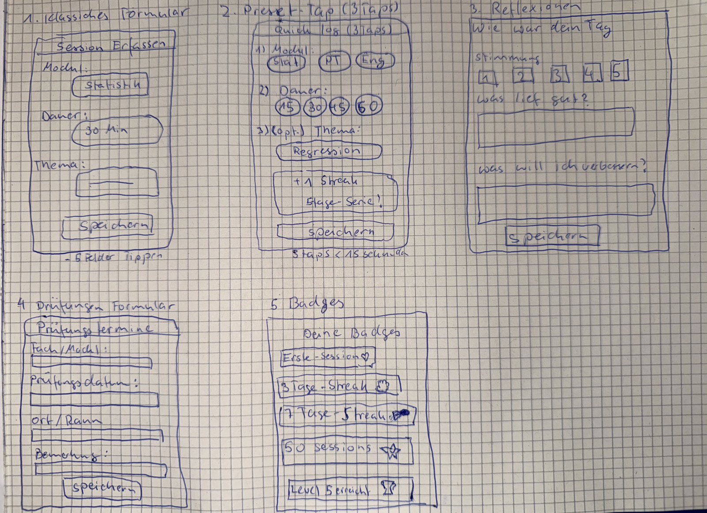
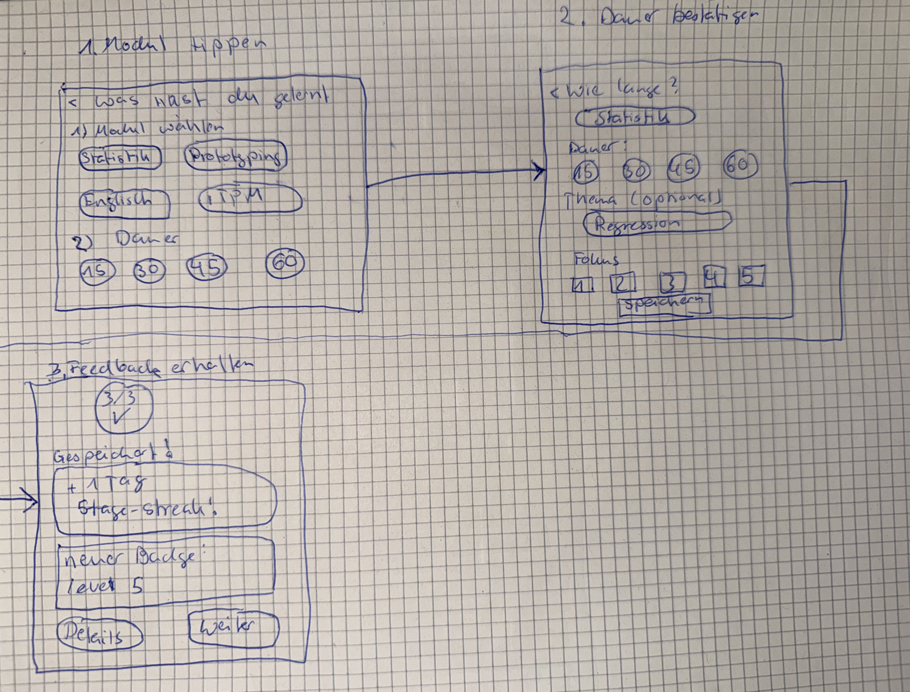
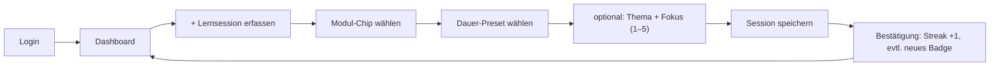
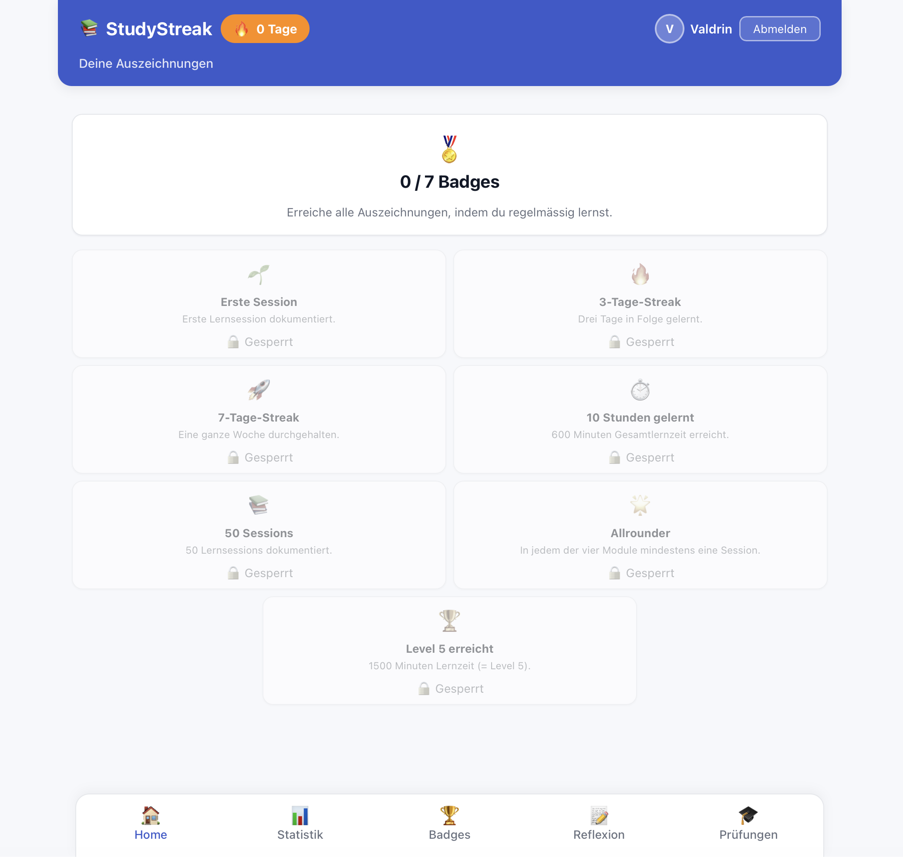
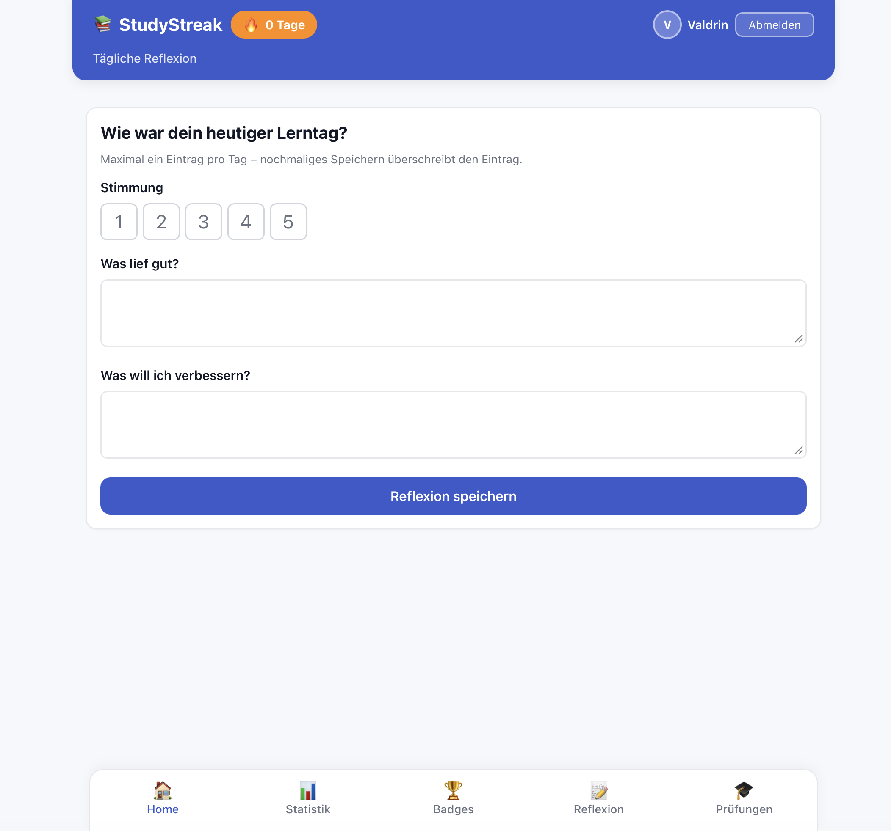
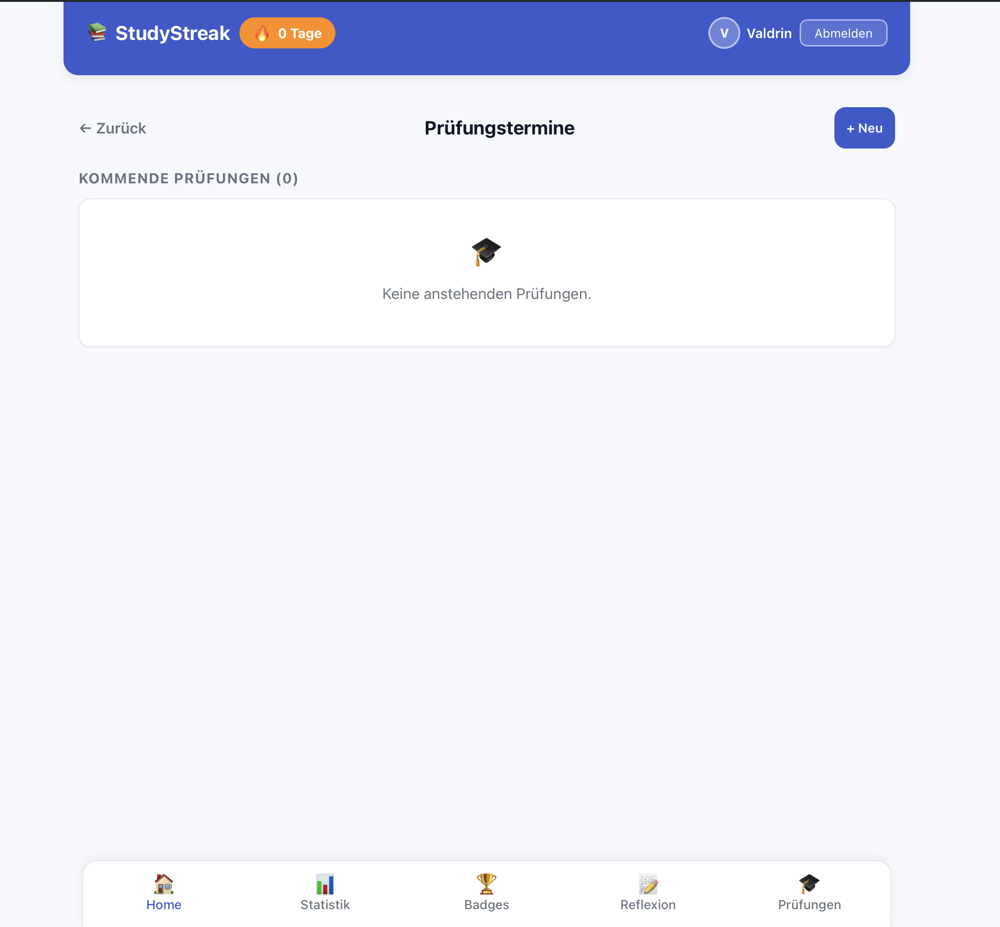
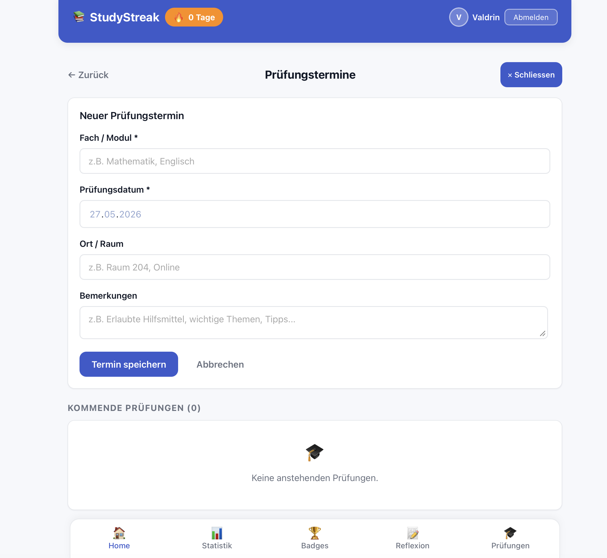
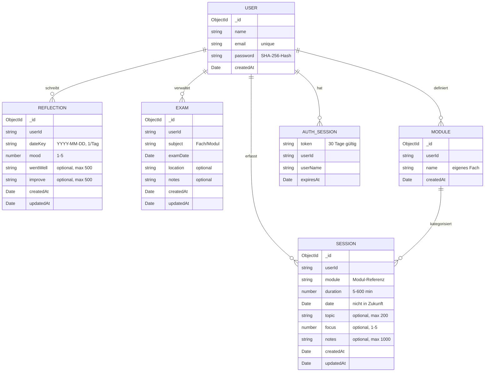

[README.md](https://github.com/user-attachments/files/28668038/README.md)
# StudyStreak – Learning Habit Tracker

> **Lerngewohnheiten aufbauen statt Last-Minute-Cramming.** StudyStreak hilft ZHAW-Studierenden, Lernsessions in unter 30 Sekunden zu erfassen, ihren Fortschritt sichtbar zu machen und sich über Streaks, Level und Badges zu motivieren.

> **Live-Demo:** https://study-streak.netlify.app
> **Repository:** https://github.com/dalipivaldrin/studystreak
> **Demo-Login:** offene Registrierung unter `/login` (eigenes Konto in < 1 Minute anlegen)
> **Figma-Mockup:** [StudyStreak – Mockup Übung 10](https://www.figma.com/design/j1DknvMCZSoX9RgQLrpkPB/StudyStreak-–-Mockup-Übung-10?node-id=0-1&p=f&t=coYxhbbPBmVZmKVS-0)

**Autor:** Valdrin Dalipi ([dalipval@students.zhaw.ch](mailto:dalipval@students.zhaw.ch)) · **Modul:** Prototyping (Übung 10–11) · **Studiengang:** Wirtschaftsinformatik Data Science, ZHAW School of Management and Law · **Semester:** FS 2026

---

## Inhaltsverzeichnis

1. [Ausgangslage](#1-ausgangslage)
2. [Lösungsidee](#2-lösungsidee)
3. [Vorgehen & Artefakte](#3-vorgehen--artefakte)
   1. [Understand & Define](#31-understand--define)
   2. [Sketch](#32-sketch)
   3. [Decide](#33-decide)
   4. [Prototype](#34-prototype)
   5. [Validate](#35-validate)
4. [Erweiterungen](#4-erweiterungen)
5. [Projektorganisation](#5-projektorganisation)
6. [KI-Deklaration](#6-ki-deklaration)
7. [Anhang](#7-anhang)

---

## 1. Ausgangslage

### Problem

Studierende im ersten Studienjahr an der ZHAW müssen parallel mehrere Module (Prototyping, ITPM, Statistik, Englisch u. a.) bearbeiten. Ein häufig beobachtetes Muster: In den ersten Wochen des Semesters wird wenig konsistent gelernt, kurz vor den Prüfungen entsteht eine chaotische, stressige Last-Minute-Phase. Die Lernpsychologie (Spacing Effect nach Ebbinghaus) zeigt, dass **verteiltes Lernen signifikant bessere Langzeitergebnisse liefert als Cramming** – dieses Wissen wird jedoch selten umgesetzt, weil ein einfaches, niedrigschwelliges Werkzeug fehlt, um Lerngewohnheiten zu etablieren und kleine tägliche Erfolge sichtbar zu machen.

### Ziele

- **Regelmässiges, verteiltes Lernen fördern** durch Gamification-Elemente (Streaks, Level, Badges)
- **Lernsessions in unter 30 Sekunden erfassen** können (niedrigschwelliger Einstieg)
- **Lernverhalten sichtbar machen** (Statistiken, Wochenziele pro Modul)
- **Intrinsische Motivation stärken** durch sichtbaren Fortschritt und Sofortbelohnung

### Primäre Zielgruppe

ZHAW-Studierende im 1.–3. Semester Informatik und Wirtschaftsinformatik, die mehrere Module parallel betreuen und ihren Lernfortschritt strukturieren möchten.

### Weitere Stakeholder

Selbstlernende ausserhalb der Hochschule (Sprachkurse, Weiterbildung), die von Habit-Tracking mit Modulbezug profitieren.

---

## 2. Lösungsidee

### Kernfunktionalität

**Session-Logging (Hauptworkflow)**
- Formular mit Modul, Datum, Dauer (Minuten), Thema, Fokus-Rating (1–5) und optionalen Notizen
- Vollständige CRUD-Operationen (Anlegen, Bearbeiten, Löschen)
- Hochoptimiert für Schnelligkeit: ≤ 3 Taps, ≤ 30 Sekunden

**Dashboard & KPIs**
- Aktuelle Streak-Anzeige (Tage in Folge)
- Level mit Fortschrittsbalken (1 Level = 300 Minuten Lernzeit)
- Wochenminuten (Ziel: 300 min/Woche)
- Liste der letzten 5 Sessions mit Click-to-Edit
- Vorschau der nächsten 3 Prüfungen mit Dringlichkeitsfarbcodes

**Authentifizierung & Mehrbenutzer-Fähigkeit**
- Registrierung und Login mit E-Mail/Passwort (gehashte Passwörter, Cookie-Sessions)
- Alle Daten (Sessions, Reflexionen, Prüfungen, Module) sind benutzerspezifisch isoliert

**Eigene Module / ZHAW-Modulkatalog**
- Statt fix vier vordefinierter Module können Studierende **eigene Fächer** anlegen
- Hinterlegter **ZHAW-Modulkatalog** (Studiengänge & Fächer) als Auswahlhilfe

**Tägliche Reflexion**
- Stimmungs-Rating (1–5)
- Zwei Freitextfelder: „Was lief gut?" und „Was will ich verbessern?"
- Genau ein Eintrag pro Tag (Upsert-Logik)

**Statistik-Seite**
- Balkendiagramm: Lernzeit pro Tag/Woche
- Filter: Woche / Monat / Gesamt
- Modul-Aufschlüsselung (farbcodiert)

**Gamification: Streak, Level, Badges**
- **Streak:** Konsekutive Tage mit mindestens einer Session. Setzt sich zurück, wenn die letzte Session älter als gestern ist.
- **Level:** `floor(Gesamtminuten / 300) + 1`
- **7 Badges** (regelbasiert): Erste Session, 3-Tage-Streak, 7-Tage-Streak, 10 Stunden gelernt, 50 Sessions, Allrounder (alle Module), Level 5 erreicht

**Prüfungstermin-Verwaltung**
- Verwaltung anstehender Prüfungen mit Fach, Datum, Ort, Bemerkungen
- Dashboard zeigt die nächsten 3 Prüfungen mit Dringlichkeitsfarbcodes (rot ≤ 3 Tage, orange ≤ 7 Tage, grün > 7 Tage)

### Annahmen

Wenn das Dokumentieren fast nichts kostet (< 30 Sekunden) und der Fortschritt sofort sichtbar wird, entsteht eine stabile Lerngewohnheit, die in langfristige akademische Erfolge mündet.

### Abgrenzung (Out of Scope)

- **Kein Live-Pomodoro-Timer** – andere Apps lösen das besser; StudyStreak dokumentiert retrospektiv
- **Kein soziales Netzwerk** – keine Freundeslisten, keine öffentlichen Rankings
- **Keine Task-Management-App** – StudyStreak denkt in Sessions, nicht in einzelnen Tasks
- **Keine Push-Notifikationen / kein nativer App-Store-Build** – die App ist eine mobile-first Web-App

### Vergleich mit Alternativen

| Tool | Fokus | Stärke | Schwäche für unsere Zielgruppe |
|---|---|---|---|
| Notion | Sehr flexibler Workspace | Universell | Keine Lern-Spezialisierung, hohe Einstiegshürde |
| Habitica | Allgemeines Habit-Tracking + Gamification | Motivationssystem | Kein Fach- oder Modulbezug |
| Forest / Flora | Live-Timer während des Lernens | Fokus-Unterstützung | Löst nicht das Reflektieren & Dokumentieren nach der Session |
| **StudyStreak** | **Retrospektives Logging mit Modulbezug** | **Schnell, zielgruppenspezifisch, motivierend** | – |

---

## 3. Vorgehen & Artefakte

Die Durchführung erfolgt phasenbasiert nach der im Modul behandelten Methodik: **Design Sprint** kombiniert mit **Human-Centered Design (ISO 9241-210)**.

### 3.1 Understand & Define

**Zielgruppenverständnis – Proto-Personas**

Um die Anforderungen zu schärfen, wurden drei repräsentative Proto-Personas definiert, die das Spektrum der Zielgruppe abdecken:

| Persona | Profil | Ziele | Pain Point (Status quo) |
|---|---|---|---|
| **Valdrin, 22** – Informatik, 1. Semester | Lernt unregelmässig, nutzt Duolingo und schätzt dessen Streak-Mechanismus | Schnelle Erfassung, sichtbarer Fortschritt, tägliche Routine | „Ich vergesse, wann ich was gelernt habe – kurz vor der Prüfung ist dann alles Chaos." |
| **Lea, 20** – Wirtschaftsinformatik, 2. Semester | Organisiert, fünf Module parallel, arbeitet sonst mit Notion | Modulbezogene Statistik, Überblick über anstehende Prüfungen | „Ich sehe nicht, in welches Modul ich eigentlich zu wenig Zeit stecke." |
| **Marco, 24** – Informatik, 3. Semester, arbeitet 60 % | Wenig Zeit, meist mobil unterwegs, skeptisch gegenüber Tools mit viel Overhead | Mobile-first, minimale Tap-Anzahl, sofortige Bestätigung | „Wenn ich mehr als 30 Sekunden brauche, um eine Session einzutragen, lasse ich es bleiben." |

**Recherche & Erkenntnisse**
- **Kurz-Interviews:** Mit Mitstudierenden (n = 3) wurden Lerngewohnheiten und Schmerzpunkte erhoben
- **Literatur:** Spacing Effect nach Ebbinghaus, Gamification-Psychologie (Duolingo-Studien)
- **Tool-Analyse:** Notion, Habitica, Forest/Flora – keines befriedigte den Spezialfall „Modul-Logging + retrospektiv + schnell"

**Wesentliche Erkenntnisse**
- Studierende wollen eine möglichst schnelle Erfassung (< 30 Sekunden) – die App soll nicht während des Lernens stören
- Sichtbarer Fortschritt (Streak, XP, Level-Balken) erhöht die Motivation nachweislich
- Modulbezogene Auswertungen sind relevanter als generelle Zeitstatistiken
- Retrospektives Logging (nach der Session) ist alltagstauglicher als ein Live-Timer

### 3.2 Sketch

**Variantenüberblick (Sketch der Schlüssel-Screens)**

Im Rahmen der Sketch-Phase wurden **fünf zentrale Screens/Varianten** der App von Hand skizziert. Für die Kerninteraktion „Lernsession erfassen" wurden zwei konkurrierende Varianten gegenübergestellt (klassisches Formular vs. Preset-Tap); die übrigen Skizzen decken die weiteren Schlüssel-Screens ab, die das Produkt vervollständigen.

| # | Variante / Screen | Kurzbeschreibung | Bewertung |
|---|---|---|---|
| 1 | **Klassisches Formular** | Modul-Dropdown, Zahlen-Input für Dauer, Thema, Speichern-Button | Vertraut, aber viele Felder zu tippen → Tastaturablenkung |
| 2 | **Preset-Tap „Tap (3 Taps)"** | Modul-Chips, Dauer-Chips (15/30/45/60), Thema/Fokus optional, Speichern | ≤ 3 Taps, einhändig, < 30 Sekunden → **gewählt** |
| 3 | **Reflexion** | „Wie war dein Tag?": Stimmungs-Rating (1–5) + zwei Freitextfelder | Ergänzt das Logging um eine qualitative Dimension |
| 4 | **Prüfungsformular** | Fach/Modul, Prüfungsdatum, Ort/Raum, Bemerkung, Speichern | Schafft Überblick über bevorstehende Prüfungen |
| 5 | **Badges** | „Deine Badges": Galerie der erreichten und gesperrten Auszeichnungen | Macht den Fortschritt greifbar und motiviert |

**Gewählte Variante für die Kerninteraktion:** **Variante 2 – Preset-Tap (3 Taps)**

**Skizzen (handgezeichnet):**



Die Skizze zeigt alle fünf Schlüssel-Screens: das klassische Formular, den gewählten Preset-Tap-Flow, die Reflexion, das Prüfungsformular und die Badge-Galerie.

### 3.3 Decide

**Entscheidung für die Kerninteraktion: Variante 2 – Preset-Tap (3 Taps)**

Für das Kernfeature „Session erfassen" standen zwei Varianten zur Wahl: das **klassische Formular (V1)** und der **Preset-Tap-Flow (V2)**. Gewählt wurde V2, weil sie das Kernversprechen am kompromisslosesten erfüllt:

- **Geschwindigkeit:** Modul-Chip + Dauer-Chip + Speichern = 3 Taps, klar unter 30 Sekunden
- **Retrospektiv:** Kein Timer, keine Push-Notifikation während des Lernens – passt zur bewussten Entscheidung, dass die App nicht stören soll
- **Gamification-Anschluss:** Nach dem Speichern wird sofort Streak-/Badge-Rückmeldung auf einem eigenen Screen angezeigt – das ist der motivationale Kern
- **Mobile-first:** Keine Eingabefelder, die die Tastatur aufziehen – alles läuft über Chips und Sterne, auch einhändig bedienbar

Das **klassische Formular (V1)** wurde verworfen, weil es zu viele Felder zum Tippen erfordert und damit die 30-Sekunden-Grenze gefährdet. Die übrigen Skizzen (V3 Reflexion, V4 Prüfungsformular, V5 Badges) sind keine Konkurrenten zur Kerninteraktion, sondern komplementäre Schlüssel-Screens, die in den Prototyp übernommen wurden.

**End-to-End-Ablauf (Happy Path)**

Der gewählte Happy-Path-Flow wurde vor der Implementierung als 3-Screen-Skizze ausgearbeitet (Modul tippen → Dauer & Details → Bestätigung mit Streak/Badge):





**End-to-End-Ablauf im Prototyp (konkret im Code umgesetzt)**

1. **Login/Registrierung:** Nutzer meldet sich an (`/login`, Cookie-Session) oder registriert ein neues Konto.
2. **Dashboard:** zeigt Streak-Pill, Level-Balken, KPI-Kacheln, die letzten 5 Sessions und die nächsten 3 Prüfungen.
3. **„+ Lernsession erfassen":** navigiert zu `/sessions/new`.
4. **Modul-Chip wählen:** aus den eigenen Modulen (z. B. „Statistik").
5. **Dauer-Preset wählen:** 15/30/45/60 min oder eigene Zeit.
6. **Optional:** Thema (Freitext, z. B. „Regression & ANOVA") und Fokus-Level (1–5 Sterne).
7. **Speichern:** Session wird in MongoDB persistiert; Weiterleitung auf die Detail-/Bestätigungsseite mit Streak-Update und ggf. neuem Badge.
8. **Zurück auf Dashboard:** Die neue Session erscheint sofort in der Liste; Statistik, Streak und Level sind aktualisiert.

**Alternative Workflows:**
- **Session bearbeiten/löschen:** Session-Karte antippen → `/sessions/[id]` → Edit- oder Delete-Button
- **Tägliche Reflexion:** Bottom-Nav → Reflexion → Stimmungs-Rating + Text → Speichern (Upsert pro Tag)
- **Statistiken einsehen:** Bottom-Nav → Statistik → Woche/Monat/Gesamt → Balkendiagramm + Modul-Aufschlüsselung
- **Prüfungen verwalten:** Bottom-Nav → Prüfungen → Formular ausfüllen → Liste mit Dringlichkeitsfarbcodes
- **Eigene Module pflegen:** `/modules` → Fach anlegen (aus ZHAW-Katalog oder frei)

**Mockup**

🔗 [Figma Prototyp: StudyStreak – Mockup Übung 10](https://www.figma.com/design/j1DknvMCZSoX9RgQLrpkPB/StudyStreak-–-Mockup-Übung-10?node-id=0-1&p=f&t=coYxhbbPBmVZmKVS-0)

Der interaktive Prototyp diente als **direkte Gestaltungsgrundlage** für die Implementierung und wurde mit echten Daten-Mustern durchgespielt, um Usability-Probleme frühzeitig zu erkennen.

---

### 3.4 Prototype

#### 3.4.1 Entwurf (Design)

**Informationsarchitektur**

```
Login / Registrierung (/login)
└─ E-Mail + Passwort → Cookie-Session

Home (Dashboard, /)
├─ Streak-Pill (Header)
├─ KPI-Kacheln: Sessions, Level, Wochenminuten
├─ Vorschau: Nächste 3 Prüfungen (mit Dringlichkeitsfarbcodes)
├─ Letzte 5 Sessions (klickbar für Bearbeitung)
└─ + Lernsession erfassen (Button)

Lernsession erfassen (/sessions/new)
├─ Modul-Chips (eigene Module, mit Farbcode)
├─ Dauer-Presets (15/30/45/60 min oder Custom)
├─ Thema (optional, Freitext)
├─ Fokus-Rating (optional, 1–5 Sterne)
└─ Session speichern (Button)

Session bearbeiten (/sessions/[id])
├─ Alle Felder editierbar (Modul, Dauer, Thema, Fokus, Notizen)
├─ Speichern-Button · Löschen-Button
└─ ← Zurück zum Dashboard (Link)

Sessions-Liste (/sessions)
└─ Vollständige Liste aller erfassten Sessions

Statistik (/stats)
├─ Tab-Filter: Woche / Monat / Gesamt
├─ Balkendiagramm: Lernzeit pro Tag/Woche (SVG)
├─ Modul-Aufschlüsselung (Farbcodes, Summen)
└─ Wochenziel-Fortschrittsbalken

Badge-Galerie (/badges)
├─ 7 Badges im Grid
├─ Freigeschaltet: farbig + Beschreibung
└─ Gesperrt: Graustufen + Bedingung

Tägliche Reflexion (/reflection)
├─ Stimmungs-Rating (1–5, interaktiv)
├─ „Was lief gut?" (Freitext, max. 500 Zeichen)
├─ „Was will ich verbessern?" (Freitext, max. 500 Zeichen)
└─ Speichern-Button (Upsert pro Tag)

Prüfungstermine (/exams)
├─ Formular: Fach, Datum, Ort, Bemerkungen
├─ Liste: Bevorstehend (mit Dringlichkeitsfarbcodes) / Vergangen (archiviert)
└─ Edit & Delete pro Prüfung

Module verwalten (/modules)
├─ Eigene Fächer anlegen (frei oder aus ZHAW-Modulkatalog)
└─ Liste der eigenen Module
```

**Wichtigste Screens der fertigen App**

| Screen | Beschreibung |
|--------|-------------|
|  | **Dashboard:** Streak-Pill im Header, KPI-Kacheln (Sessions, Level, Wochenminuten), Fortschrittsbalken zum nächsten Level, Liste der letzten 5 Sessions mit Click-to-Edit. |
|  | **Session erfassen:** Modul-Chips (farblich nach Modul), Dauer-Presets (15/30/45/60 min oder custom), optionaler Freitext für Thema, Fokus-Rating (1–5 Sterne), Speichern-Button. |
|  | **Statistik-Seite:** Tab-Filter (Woche/Monat/Gesamt), Balkendiagramm Lernzeit/Tag (SVG), Modul-Aufschlüsselung (farbig mit Summen), Wochenziel-Fortschritt. |
|  | **Badge-Galerie:** 7 Auszeichnungen im Grid, erreichte Badges farbig mit Beschreibung, gesperrte Badges grauskaliert mit Bedingungen. |
|  | **Tägliche Reflexion:** Stimmungs-Rating (1–5, interaktiv), zwei Freitextfelder („Was lief gut?" / „Was will ich verbessern?"), Speichern-Button, Upsert pro Tag. |
|  | **Prüfungstermin-Formular:** Felder für Fach/Modul, Datum, Ort/Raum, Bemerkungen, Speichern-Button mit Validierung. |
|  | **Prüfungsliste:** Bevorstehend (mit Dringlichkeitsfarbcodes: rot ≤ 3 Tage, orange ≤ 7 Tage, grün > 7 Tage), Vergangen (archiviert), Edit & Delete pro Eintrag. |

> Die handgezeichneten Artefakte zur Sketch-Phase befinden sich unter `docs/screenshots/08-prototypes-5variants.png` (5 Varianten) und `docs/screenshots/09-user-flow.png` (User-Flow).

**Designentscheidungen**

- **Mobile-First Layout:** Optimiert für Smartphone (max-width 480 px). Lernen findet mobil und spontan statt; Daumen-Zone-Freundlichkeit ist kritisch.
- **Bottom Navigation:** Etabliertes Muster für Mobile Apps mit 5 Tabs: **Home, Statistik, Badges, Reflexion, Prüfungen**. Alle Hauptbereiche sind mit dem Daumen erreichbar.
- **Chip-Buttons für Modulwahl & Dauer:** Schnelles Antippen ohne Tastatur-Ablenkung; auch einhändig bedienbar. Farbliche Codierung macht Module schnell erkennbar.
- **Gamification prominent platziert:** Streak immer im Header sichtbar; Erfolgsmeldung nach dem Speichern als Bestätigungsscreen mit Badge-Benachrichtigung.
- **Farbkonzept:**
  - Primary Blue `#3A5ACC` – Buttons, Links, Header
  - Streak Orange `#FF8C00` – Streak-Pill, Erfolgsfarben
  - Success Green `#28A745` – Bestätigung, Speichern
  - Modul-Farben: Prototyping = Violett `#8B5CF6`, ITPM = Grün `#10B981`, Statistik = Gelb/Amber `#F59E0B`, Englisch = Rot `#EF4444`
- **SVG-Balkendiagramm statt externe Charting-Lib:** Volle Designkontrolle, kein zusätzlicher Build-Overhead, performant für kleine Datenmengen.
- **Progressive Enhancement:** Alle CRUD-Aktionen funktionieren über SvelteKit Form Actions – auch ohne JavaScript bedienbar.
- **Serverseitige Validierung:** Alle Eingaben werden auf dem Server überprüft (Pflichtfelder, Längenlimits, Datumsplausibilität). Fehler werden feldweise angezeigt; eingegebene Werte bleiben erhalten.

#### 3.4.2 Umsetzung (Technik)

**Technologie-Stack**
- **Frontend:** Svelte 4 (via SvelteKit 2)
- **Backend:** SvelteKit (Node.js auf Netlify Functions)
- **Styling:** Handgeschriebenes CSS mit CSS-Variablen (keine externe UI-Lib)
- **Datenbank:** MongoDB Atlas (Free-Tier M0)
- **Auth:** Eigenes E-Mail/Passwort-Login (SHA-256-Hash, Cookie-Sessions)
- **Hosting:** Netlify mit `@sveltejs/adapter-netlify`
- **Build-Tool:** Vite
- **IDE:** VS Code mit GitHub Copilot (KI-Unterstützung dokumentiert in Kap. 6)

**Tooling**
- **Figma:** Mockup & Prototyping (siehe Kap. 3.3)
- **GitHub:** Version Control, Issues zur Nachverfolgung von Evaluations-Findings
- **MongoDB Compass:** Lokale DB-Verwaltung während der Entwicklung

**Struktur & Komponenten**

```
src/
├── app.css                              ← Globales CSS mit Design-Tokens
├── app.html                             ← HTML-Shell
├── hooks.server.js                      ← Server-Hooks (Request-Logging)
├── lib/
│   ├── constants.js                     ← Module, Badges, Fokus-/Mood-Labels
│   ├── modulkatalog.js                  ← ZHAW-Modulkatalog (Studiengänge & Fächer)
│   ├── server/
│   │   ├── db.js                        ← MongoDB-Client (Connection-Caching)
│   │   └── auth.js                      ← Registrierung, Login, Session-Tokens
│   ├── utils/
│   │   ├── gamification.js              ← Streak, Level, Stats, Badge-Auswertung
│   │   └── validation.js                ← Server-Validierung (Session, Reflexion)
│   └── components/
│       ├── BottomNav.svelte             ← Navigation (5 Tabs)
│       ├── StreakDisplay.svelte         ← Streak-Pill
│       ├── StatBadge.svelte             ← KPI-Kachel
│       ├── SessionCard.svelte           ← Session-Kartenelement
│       ├── LevelProgress.svelte         ← Level-Fortschrittsbalken
│       ├── BadgeCard.svelte             ← Badge-Kartenelement
│       └── BarChart.svelte              ← SVG-Balkendiagramm
└── routes/
    ├── +layout.svelte                   ← App-Header, Bottom-Nav, Slot
    ├── +layout.server.js                ← Globale Stats für Header (Streak, Level)
    ├── +page.svelte                     ← Dashboard
    ├── +page.server.js                  ← Dashboard-Load (auth-geschützt)
    ├── +error.svelte                    ← Error-Handling
    ├── login/
    │   ├── +page.svelte                 ← Login / Registrierung
    │   └── +page.server.js              ← Form Actions: register, login, logout
    ├── sessions/
    │   ├── +page.svelte                 ← Sessions-Liste
    │   ├── +page.server.js
    │   ├── new/
    │   │   ├── +page.svelte             ← Session erfassen
    │   │   └── +page.server.js          ← Form Action: createSession
    │   └── [id]/
    │       ├── +page.svelte             ← Session Detail + Edit + Delete
    │       └── +page.server.js          ← Form Actions: updateSession, deleteSession
    ├── stats/
    │   ├── +page.svelte                 ← Statistik-Seite mit Filter
    │   └── +page.server.js              ← Aggregation nach Zeitraum & Modul
    ├── badges/
    │   ├── +page.svelte                 ← Badge-Galerie
    │   └── +page.server.js
    ├── reflection/
    │   ├── +page.svelte                 ← Tägliche Reflexion (Upsert)
    │   └── +page.server.js              ← Form Action: upsertReflection
    ├── exams/
    │   ├── +page.svelte                 ← Prüfungstermin-Verwaltung
    │   └── +page.server.js              ← CRUD für Prüfungen
    ├── modules/
    │   ├── +page.svelte                 ← Eigene Module verwalten
    │   └── +page.server.js              ← CRUD für Module (auth-geschützt)
    └── api/
        └── modules/+server.js           ← JSON-Endpoint für Module
```

**Datenmodell – ER-Diagramm**

Alle Daten liegen in MongoDB Atlas. Streak/Level/Stats werden **nicht** persistiert, sondern bei jedem Request aus den Sessions berechnet (Single Source of Truth).



**Collections im Überblick:** `users`, `auth_sessions`, `modules`, `sessions`, `reflections`, `exams`.

**Validierung (serverseitig)**

Jede Form Action validiert die Eingaben über `validateSession()` bzw. `validateReflection()` (in `src/lib/utils/validation.js`); Prüfungen werden direkt in der Form Action validiert.

```text
validateSession:
- module:   erforderlich (Modul-Referenz, nicht leer)
- duration: erforderlich, Zahl 5–600 (Minuten)
- date:     optional (Default: heute), nicht in der Zukunft
- topic:    optional, max 200 Zeichen
- focus:    optional, 1–5
- notes:    optional, max 1000 Zeichen

validateReflection:
- mood:     erforderlich, 1–5
- wentWell: optional, max 500 Zeichen
- improve:  optional, max 500 Zeichen
- date:     optional (Default: heute)

Prüfungen (exams):
- subject:  erforderlich
- examDate: erforderlich, gültiges Datum
- location: optional
- notes:    optional
```

Fehler werden als `fail(400, { errors, values })` an die Seite zurückgegeben und dort **feldweise angezeigt**; eingegebene Werte bleiben im Formular erhalten (für schnelle Korrektur).

**Gamification-Logik** (`src/lib/utils/gamification.js`)

- **Streak:** Konsekutive Tage mit mindestens einer Session, gerechnet ab heute (oder ab gestern, falls heute noch nichts erfasst wurde). Wird bei jedem Request neu aus den Sessions berechnet; zusätzlich wird die längste je erreichte Streak ermittelt.
- **Level:** `level = floor(totalMinutes / 300) + 1`. Der Fortschrittsbalken zeigt die im aktuellen Level verbrauchten Minuten.
- **7 Badges** (regelbasiert, ausgewertet in `evaluateBadges`):

| Badge | Icon | Bedingung |
|---|---|---|
| Erste Session | 🌱 | mind. 1 Session erfasst |
| 3-Tage-Streak | 🔥 | aktuelle oder längste Streak ≥ 3 |
| 7-Tage-Streak | 🚀 | aktuelle oder längste Streak ≥ 7 |
| 10 Stunden gelernt | ⏱️ | Gesamtlernzeit ≥ 600 min |
| 50 Sessions | 📚 | ≥ 50 Sessions erfasst |
| Allrounder | 🌟 | mind. 1 Session in jedem der vier Module |
| Level 5 erreicht | 🏆 | Gesamtlernzeit ≥ 1500 min |

**Deployment**

- **Hosting:** Netlify mit `@sveltejs/adapter-netlify`
- **Build-Befehl:** `npm run build`
- **Umgebungsvariablen:** `MONGODB_URI` (Pflicht) und optional `MONGODB_DB` (Default: `studystreak`) – im Netlify-Dashboard hinterlegt
- **Live-URL:** https://study-streak.netlify.app
- **Cold-Start-Optimierung:** Der MongoDB-Client wird als gecachte Connection-Promise gehalten und zwischen Function-Aufrufen wiederverwendet (`maxPoolSize: 5`)

**Lokale Entwicklung**

```bash
# 1. Repository klonen
git clone https://github.com/dalipivaldrin/studystreak
cd studystreak

# 2. Abhängigkeiten installieren
npm install

# 3. .env-Datei anlegen (Vorlage: .env.example)
cp .env.example .env
# → MONGODB_URI mit deinem MongoDB-Atlas-String eintragen
#   (optional MONGODB_DB setzen, Default: studystreak)

# 4. Dev-Server starten
npm run dev
# → App läuft auf http://localhost:5173

# 5. Type-Check nach Änderungen an .svelte-Dateien
npm run check

# 6. Production-Build lokal testen
npm run build
npm run preview
```

**Besondere Entscheidungen & Trade-offs**

1. **Handgeschriebenes CSS statt UI-Framework:** volle Designkontrolle, kein Bloat, CSS-Variablen für Theme-Konsistenz – mehr manuelle Arbeit, aber für ein MVP angemessen.
2. **MongoDB statt SQLite:** serverless-kompatibel (Netlify), kein persistentes Filesystem nötig, mehrbenutzerfähig durch `userId`-Filter.
3. **Form Actions statt Client-side Fetch:** funktioniert auch ohne JavaScript (Progressive Enhancement), reduzierte Komplexität (keine separate API), automatische CSRF-Protection in SvelteKit.
4. **Streak/Level/Stats nicht in der DB persistiert:** eine einzige Quelle der Wahrheit (Sessions), keine Inkonsistenzen – Berechnung bei jedem Request, für diese Datenmengen vernachlässigbar.
5. **Eigene Auth statt externem Provider:** transparent und ohne zusätzliche Abhängigkeit für die Prototyping-Phase. SHA-256 ist bewusst einfach gehalten; für Produktion wäre ein dedizierter Passwort-Hash (z. B. bcrypt/argon2) nötig.

---

### 3.5 Validate

**URL der getesteten Version:** https://study-streak.netlify.app (getestet am **14. Mai 2026**)

**Ziele der Prüfung**
1. Ist der Kernworkflow „Lernsession in unter 30 Sekunden erfassen" ohne Anleitung auffindbar und durchführbar?
2. Funktioniert die Bearbeitung einer bereits gespeicherten Session intuitiv?
3. Ist die tägliche Reflexion selbsterklärend?
4. Findet die Testperson die Wochenstatistik ohne Hilfe?
5. Sind die Gamification-Elemente (Streak, Level) motivierend?

**Vorgehen**
- **Methode:** Moderierter Thinking-Aloud-Usability-Test
- **Setting:** On-site (ZHAW-Atelier)
- **Dauer:** ~20 Minuten pro Testperson
- **Protokollierung:** Beobachtungsformular mit Feedback-Grid
- **Dokumentation:** [docs/usability-test-skript.md](docs/usability-test-skript.md)

**Stichprobe**
- **1 Testperson:** Marko Vukcevic (22 Jahre, Wirtschaftsinformatik-Student)
- **Profil:** Kennt Habit-Tracking-Apps (Duolingo), hat StudyStreak vor dem Test nicht gesehen
- **Auswahlkriterium:** Repräsentativ für die Zielgruppe (Student, parallele Module, Gamification-Affinität)

**Aufgaben & Szenarien**

> **Ausgangslage:** Sie sind Student im ersten Studienjahr und möchten Ihre Lerngewohnheiten verbessern. Sie haben heute 45 Minuten für Statistik gelernt und möchten das festhalten.

| Aufgabe | Task | Erfolgskriterium | Ergebnis |
|---|---|---|---|
| **T1 – Session erfassen** | „Erfassen Sie, dass Sie heute 45 Minuten für Statistik gelernt haben." | Session erscheint auf dem Dashboard innerhalb von 30 Sekunden | ✅ in ~22 s |
| **T2 – Session bearbeiten** | „Es waren eigentlich 60 Minuten. Korrigieren Sie die Session." | Geänderte Dauer wird auf dem Dashboard angezeigt | ⚠️ mit Umweg (~45 s) |
| **T3 – Reflexion** | „Tragen Sie eine kurze Reflexion ein (Stimmung 5)." | Reflexion wird gespeichert und ist abrufbar | ✅ problemlos |
| **T4 – Statistik** | „Wie viele Minuten haben Sie diese Woche gelernt?" | Statistik-Seite wird gefunden, Werte korrekt interpretiert | ✅ in ~15 s |

**Beobachtungen pro Task**

| Task | Status | Beobachtung |
|---|---|---|
| T1 – Session erfassen | ✅ Erfolg | Modul-Chips sofort verstanden. Dauer-Presets intuitiv. Kein Zögern beim Speichern. |
| T2 – Session bearbeiten | ⚠️ Erfolg mit Umweg | Suchte zuerst auf dem Dashboard einen Edit-Button direkt auf der Session-Karte. Musste die Karte antippen, um zur Detail-Ansicht zu gelangen. Nach Umlenkung: schnelle Bearbeitung. |
| T3 – Reflexion | ✅ Erfolg | Bottom-Nav-Einstieg sofort klar. Stimmungs-Rating (1–5) intuitiv. Text-Eingabe flüssig. |
| T4 – Statistik | ✅ Erfolg | Stats-Tab sofort gefunden. Balkendiagramm korrekt interpretiert. Woche/Monat/Gesamt-Filter verstanden. |

**Feedback-Grid** (Marko Vukcevic)

| ✅ Was hat gut funktioniert? | ❌ Was hat gestört? | 💡 Neue Ideen |
|---|---|---|
| Chip-Auswahl für Modul und Dauer ist sehr schnell und intuitiv | Session-Karte auf dem Dashboard wirkte zunächst nicht klickbar | Session-Karte deutlicher als klickbar kennzeichnen |
| Streak-Counter auf dem Dashboard ist motivierend | Nach dem Speichern war der „← Zurück"-Link zu klein | Deutlicherer CTA-Button „→ Zum Dashboard" |
| Farbliche Modul-Kennzeichnung hilft bei der Orientierung | Tab-Label „Stats" war zu generisch | Label zu „Statistik" ändern |
| App läuft auch auf dem Smartphone gut | – | Optional: Onboarding-Tour beim ersten Start |

**Zusammenfassung der Resultate**

Der **Kernworkflow (T1) wurde in ~22 Sekunden** und **ohne Hilfe abgeschlossen** – das Kernziel von **unter 30 Sekunden ist erreicht**. Reflexion und Statistik funktionierten problemlos. Die **grösste Schwachstelle war die fehlende Direktnavigation** von der Session-Karte zur Bearbeitungsansicht (T2).

**Fazit der Testperson:** „Die App ist schnell und macht Spass. Der Streak motiviert mich, täglich zu lernen. Die Darstellung ist klar. Ich würde sie nutzen."

**Abgeleitete Verbesserungen (Prioritäten)**

| Priorität | Massnahme | Begründung | Status |
|---|---|---|---|
| **Hoch** | Session-Karte auf Dashboard klickbar → direkt zur Detail-/Edit-Ansicht ([Issue #2](https://github.com/dalipivaldrin/studystreak/issues/2)) | T2: Testperson erwartete Direktnavigation | ✅ Umgesetzt |
| **Hoch** | Deutlicherer CTA-Button „→ Zum Dashboard" auf dem Speichern-Screen ([Issue #1](https://github.com/dalipivaldrin/studystreak/issues/1)) | „← Zurück" war zu wenig sichtbar | ✅ Umgesetzt |
| **Mittel** | Tab-Label von „Stats" zu „Statistik" ([Issue #3](https://github.com/dalipivaldrin/studystreak/issues/3)) | Bezeichnung war zu generisch | ✅ Umgesetzt |
| **Gering** | Onboarding-Overlay beim ersten App-Start | Orientierung für neue Nutzer | ⏳ Für nächste Phase |

---

## 4. Erweiterungen

Folgende Erweiterungen gehen über den geforderten Mindestumfang hinaus und wurden basierend auf Evaluations-Findings oder zur Verbesserung der Robustheit implementiert.

### 4.1 Session-Karte auf Dashboard klickbar (Edit-Flow)

- **Beschreibung & Nutzen:** Session-Karten auf dem Dashboard sind direkt klickbar und führen zur Detail-/Bearbeitungsansicht. Reduziert Navigationsschritte für den häufigen Use Case „Session nachträglich korrigieren".
- **Wo umgesetzt:** `src/routes/+page.svelte` (SessionCard als Link), `src/routes/sessions/[id]/+page.svelte` + `+page.server.js` (Edit/Delete-Actions).
- **Aus Evaluation abgeleitet?** **Ja** – aus T2, als GitHub Issue #2 angelegt und sofort umgesetzt.

### 4.2 Statistik-Seite mit interaktiven Filtern und SVG-Diagramm

- **Beschreibung & Nutzen:** Balkendiagramm der Lernzeit pro Tag/Woche, filterbar nach Woche/Monat/Gesamt, plus Modul-Aufschlüsselung mit Farbcodes. Ermöglicht das Erkennen von Lernmustern und das gezielte Fördern schwächerer Module.
- **Wo umgesetzt:** `src/routes/stats/+page.svelte`, `src/lib/components/BarChart.svelte` (SVG, handgezeichnet), `src/routes/stats/+page.server.js` (Aggregation).
- **Technische Highlights:** SVG ohne externe Charting-Lib, responsive Skalierung anhand der Daten-Maxima, Farbcodierung nach Modul.
- **Aus Evaluation abgeleitet?** Nein – von Anfang an Teil des Konzepts.

### 4.3 Gamification-Pipeline (Streak, Level, Badges)

- **Beschreibung & Nutzen:** Eine dedizierte Logik-Bibliothek berechnet Streak (mit längster je erreichter Serie), Level (`floor(totalMinutes / 300) + 1`) und 7 regelbasierte Badges (siehe Tabelle in Kap. 3.4.2). Sichtbarer Fortschritt fördert das tägliche Zurückkehren zur App.
- **Wo umgesetzt:** `src/lib/utils/gamification.js`; Frontend: `StreakDisplay.svelte`, `LevelProgress.svelte`, `BadgeCard.svelte`, `src/routes/badges/+page.svelte`.
- **Edge-Cases:** korrektes Verhalten an der Tagesgrenze (Mitternacht) und an der Wochengrenze (Montag 00:00).
- **Aus Evaluation abgeleitet?** Nein – von Anfang an geplant; positiv kommentiert.

### 4.4 Tägliche Reflexion (zweiter Workflow)

- **Beschreibung & Nutzen:** Eigener Workflow mit Stimmungs-Rating (1–5) und zwei Freitextfeldern. Genau ein Eintrag pro Tag (Upsert mit `dateKey` als natürlichem Schlüssel je Nutzer). Ergänzt das Session-Logging um eine qualitative Dimension.
- **Wo umgesetzt:** `src/routes/reflection/+page.svelte` + `+page.server.js`; Collection `reflections` (Upsert auf `{ dateKey, userId }`).
- **Aus Evaluation abgeleitet?** Nein – von Anfang an als zweiter Workflow definiert.

### 4.5 Prüfungstermin-Verwaltung (Exams)

- **Beschreibung & Nutzen:** Route `/exams` zur Verwaltung von Prüfungsterminen (Fach, Datum, Ort, Bemerkungen). Das Dashboard zeigt die nächsten 3 Prüfungen als farbcodierte Dringlichkeitskarten (rot ≤ 3 Tage, orange ≤ 7 Tage, grün > 7 Tage). Vergangene Prüfungen werden archiviert.
- **Wo umgesetzt:** `src/routes/exams/+page.svelte` + `+page.server.js` (CRUD); Dashboard-Vorschau in `src/routes/+page.server.js`; Collection `exams`.
- **Aus Evaluation abgeleitet?** Nein – ergänzt das Session-Logging um Zielorientierung.

### 4.6 Serverseitige Validierung

- **Beschreibung & Nutzen:** Alle Formulare werden serverseitig validiert (Pflichtfelder, Längenlimits, Wertebereiche, Datumsplausibilität). Feldweise Fehleranzeige mit Erhalt der eingegebenen Werte.
- **Wo umgesetzt:** `src/lib/utils/validation.js` (`validateSession`, `validateReflection`), Prüfungs-Validierung direkt in der Form Action.
- **Regeln:** siehe Validierungsblock in Kap. 3.4.2 (Dauer 5–600 min, Thema ≤ 200, Session-Notizen ≤ 1000, Reflexionstexte ≤ 500 Zeichen).
- **Aus Evaluation abgeleitet?** Nein – technische Qualitätsentscheidung.

### 4.7 Progressive Enhancement (Form Actions ohne JavaScript)

- **Beschreibung & Nutzen:** Alle CRUD-Aktionen funktionieren vollständig über SvelteKit Form Actions – auch ohne JavaScript. Mit `use:enhance` wird das UI optimistisch aktualisiert, wenn JavaScript verfügbar ist.
- **Wo umgesetzt:** `use:enhance` in allen Formularen; Form Actions in allen `+page.server.js`-Dateien.
- **Aus Evaluation abgeleitet?** Nein – technische Designentscheidung für Robustheit.

### 4.8 Eigene Module / ZHAW-Modulkatalog

- **Beschreibung & Nutzen:** Über `/modules` legen Studierende **eigene Fächer** an, die anschliessend beim Session-Erfassen als Chips wählbar sind. Ein hinterlegter **ZHAW-Modulkatalog** (`src/lib/modulkatalog.js`) liefert Studiengänge und Fächer als Auswahlhilfe. Damit ist die App nicht mehr auf vier vordefinierte Module beschränkt.
- **Wo umgesetzt:** `src/routes/modules/+page.svelte` + `+page.server.js` (CRUD, auth-geschützt), `src/routes/api/modules/+server.js` (JSON-Endpoint), Collection `modules` (pro `userId`).
- **Status:** ✅ Umgesetzt (über den ursprünglichen Mindestumfang hinaus).

### 4.9 Authentifizierung & Mehrbenutzer-Fähigkeit

- **Beschreibung & Nutzen:** Registrierung und Login mit E-Mail/Passwort. Passwörter werden gehasht (SHA-256), Sessions über ein zufälliges Token in einem HttpOnly-Cookie verwaltet (30 Tage gültig). Alle Inhalte sind pro Nutzer isoliert (`userId`-Filter in jeder Query). Geschützte Routen leiten ohne gültige Session auf `/login` um.
- **Wo umgesetzt:** `src/lib/server/auth.js` (registerUser, loginUser, createSession, validateSession, deleteSession), `src/routes/login/+page.server.js` (Actions: register, login, logout); Collections `users` und `auth_sessions`.
- **Status:** ✅ Umgesetzt. Hinweis: SHA-256 ist für die Prototyping-Phase bewusst einfach gehalten; produktiv wäre ein dedizierter Passwort-Hash (bcrypt/argon2) angebracht.

---

## 5. Projektorganisation

### Repository & Struktur
- **URL:** https://github.com/dalipivaldrin/studystreak
- **Hosting:** GitHub (öffentlich einsehbar für Dozierende)
- **Collaborators:** mmeisterhans, bkuehnis (als Dozierende hinzugefügt gemäss Aufgabenstellung)
- **Branch-Strategie:** Trunk-Based Development auf `main`. Feature-Arbeit in kurzen lokalen Branches, gemergt mit Squash-Commits.

### Issue-Management
- **GitHub Issues** für Bugs und Erweiterungs-Ideen, verknüpft mit Commits via `Closes #<nr>`.
- **Evaluations-Findings** als priorisierte Issues:
  - Issue #1: Deutlicherer CTA auf Speichern-Screen ✅
  - Issue #2: Session-Karte klickbar ✅
  - Issue #3: Tab-Label „Statistik" statt „Stats" ✅

### Commit-Praxis
- **Format:** Sprechende Commit-Messages im Imperativ.
- **Beispiele:**
  - `init: scaffold sveltekit + mongodb setup`
  - `feat: add session logging with module chips`
  - `feat: add gamification streak, level, badges`
  - `feat: add email/password auth with cookie sessions`
  - `feat: add user-defined modules + zhaw catalog`
  - `fix: streak calculation around midnight`
  - `docs: add usability test results`
- **Häufigkeit:** Nach jedem logischen Schritt (Feature, Fix, Docs).

---

## 6. KI-Deklaration

### 6.1 KI-Tools

- **Claude** (Anthropic) – Code-Generierung, Dokumentation, Sparring
- **GitHub Copilot** (in VS Code) – Code-Vervollständigung, Snippets

### 6.2 Prompt-Vorgehen

**Zweck & Umfang des KI-Einsatzes:**

*Übung 10 (Mockup & Ideenfindung):*
- Formulierung der Sketch-Beschreibungen (5 Varianten/Screens)
- Sparringspartner für die Variantenbewertung
- Sprachliche Überarbeitung der Dokumentation
- Erstellung der README-Vorlage auf Basis des Figma-Mockups

*Übung 11 (Prototyp & Implementierung):*
- Generierung des **SvelteKit-Grundgerüsts** (Routen-Struktur, Komponenten, MongoDB-Anbindung) auf Basis der vom Autor definierten Architektur
- Unterstützung bei **Auth** (Hash + Cookie-Sessions) und **Custom-Modulen / Modulkatalog** entlang der Autor-Vorgaben
- Aufbau der **CSS-Design-Tokens** entlang des selbst erstellten Figma-Mockups
- Sprachliche Glättung der Dokumentation (README, Usability-Test-Protokoll)

**Eigene Leistung (Abgrenzung):**

*Konzeptionell (100 % Autor):* Projektidee, Zielgruppenanalyse & Personas, Sketch-Skizzen (Stift auf Papier), Variantenwahl mit Begründung, End-to-End-Ablauf, Gamification-Regeln, Figma-Mockup, Farbkonzept, Durchführung & Auswertung des Usability-Tests.

*Technisch (Autor mit KI-Unterstützung):* Architektur, Datenmodell und Trennung von Business-Logic und UI durch den Autor; KI lieferte Vorschläge, die der Autor gegengelesen, angepasst, integriert und manuell getestet hat (inkl. Edge-Case-Tests für Streak und Connection-Pooling); Deployment (MongoDB Atlas, Netlify, Umgebungsvariablen) durch den Autor.

**Konkrete Beispiele:**

1. **Streak-Berechnung (kritischer Bug):** Ein erster KI-Vorschlag verglich Datumswerte direkt (`lastSessionDate > yesterday`) und scheiterte an der Mitternacht-Grenze. Der Autor erkannte den Fehler; korrigiert wurde auf einen Vergleich auf Tagesschlüssel-Ebene (`YYYY-MM-DD`).
2. **CSS-Responsive-Breakpoints:** Autor-Vorgabe „Mobile-first, max-width 480 px, Daumen-Zone-freundlich"; KI schlug CSS-Variablen und Flexbox-Grids vor, der Autor verfeinerte Lesbarkeit und Schriftgrössen.
3. **README-Dokumentation:** Autor lieferte Rohdaten (Testbeobachtungen, Screenshots); KI strukturierte Tabellen und Klartext; der Autor prüfte Fakten und Terminologie gegen den Code.

### 6.3 Reflexion

**Nutzen:** schnelleres Grundgerüst, konsistente CSS-/Komponenten-Struktur, flüssigere Dokumentation.

**Grenzen & Risiken:** KI-Code muss kritisch geprüft werden (z. B. fehlerhafte Streak-Berechnung an Tagesgrenzen, Connection-Pooling für Cold-Starts). Die inhaltliche und technische Verantwortung bleibt **allein beim Autor**.

**Qualitätssicherung:** manuelle Code-Reviews vor jedem Commit, lokale Dev-Tests, produktive Tests (Netlify-Deploy, Usability-Test).

---

## 7. Anhang

### Projektmaterialien & Quellen

**Figma Mockup**
- 🔗 [StudyStreak – Mockup Übung 10](https://www.figma.com/design/j1DknvMCZSoX9RgQLrpkPB/StudyStreak-–-Mockup-Übung-10?node-id=0-1&p=f&t=coYxhbbPBmVZmKVS-0) – interaktiver Prototyp, direkte Gestaltungsgrundlage für die Implementierung.

**Artefakte aus Ideenfindung & Sketch**
- 🎨 [Sketch der 5 Varianten / Schlüssel-Screens](docs/screenshots/08-prototypes-5variants.png) – handgezeichnet (klassisches Formular, Preset-Tap, Reflexion, Prüfungsformular, Badges)
- 🔁 [User-Flow: Session erfassen](docs/screenshots/09-user-flow.png) – Happy-Path-Skizze (Modul tippen → Dauer & Details → Bestätigung)

**Evaluationsmaterialien**
- 🧪 [Usability-Test-Skript & Resultate](docs/usability-test-skript.md) – Aufgaben T1–T4, Erfolgskriterien, Feedback-Grid und abgeleitete Verbesserungen.

**Prototyp & Code**
- 🚀 [Live-App](https://study-streak.netlify.app) – produktive URL auf Netlify
- 💾 [GitHub Repository](https://github.com/dalipivaldrin/studystreak) – kompletter Quellcode mit Git-History
- 📱 Screenshots unter `docs/screenshots/` – 7 App-Screens (01–07) + 2 Sketch-Artefakte (08–09)

**Video-Walkthrough**
- 🎬 [Video-Walkthrough ansehen](LINK-BIS-ABGABE-EINFÜGEN) – ca. 7 Min. (6:58); erläutert das Vorgehen und demonstriert alle Workflows (Login, Session erfassen/bearbeiten, Statistik, Reflexion, Prüfungen, Module). *Wird separat bis zur Abgabefrist eingereicht; Link hier einfügen.*

**Dokumentation**
- 📋 `README.md` – diese Datei (vollständige Projektdokumentation nach Vorlage)
- 📄 `CLAUDE.md` – Projektkontext und Anforderungen (interne Referenz)
- 📄 `ANFORDERUNGEN.md` – Erfüllungsstand aller Anforderungen (Selbstbewertung)

**Technische Referenzen**
- [SvelteKit Dokumentation](https://kit.svelte.dev/)
- [MongoDB Atlas Free Tier](https://www.mongodb.com/cloud/atlas)
- [Netlify Adapter für SvelteKit](https://github.com/sveltejs/kit/tree/master/packages/adapter-netlify)
- [MDN: CSS Custom Properties](https://developer.mozilla.org/en-US/docs/Web/CSS/--*)

### Anmerkungen für Dozierende

**Video-Walkthrough:** wird separat eingereicht (bis Abgabefrist), Dauer ca. 7 Minuten (6:58); erläutert das Vorgehen und zeigt alle Workflows (Login, Session erfassen/bearbeiten, Statistik, Reflexion, Prüfungen, Module).

**Authentifizierung:** Die App nutzt ein eigenes E-Mail/Passwort-Login mit Cookie-Session. Ein Test-Konto lässt sich in unter einer Minute über `/login` registrieren (offene Registrierung). SHA-256 ist für die Prototyping-Phase bewusst einfach gehalten.

**Zugänglichkeit der App:**
- ✅ Live unter https://study-streak.netlify.app
- ✅ Konto-Erstellung ohne Freischaltung möglich
- ✅ Mobile-responsive (auch auf dem Smartphone testbar)
- ✅ Progressive Enhancement (CRUD funktioniert auch ohne JavaScript)

**Kontakt:** [dalipval@students.zhaw.ch](mailto:dalipval@students.zhaw.ch)

---

**Projektstart:** Februar 2026 · **Fertigstellung:** Mai 2026 · **Modul:** Prototyping (Übung 10–11)
**Hochschule:** ZHAW – School of Management and Law · **Verfasser:** Valdrin Dalipi
